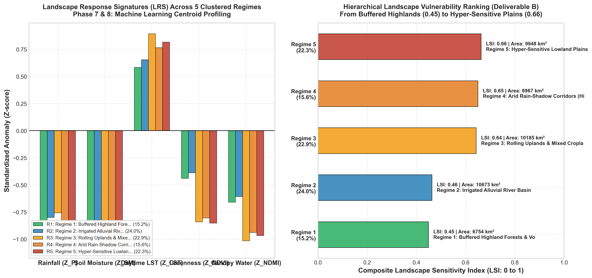
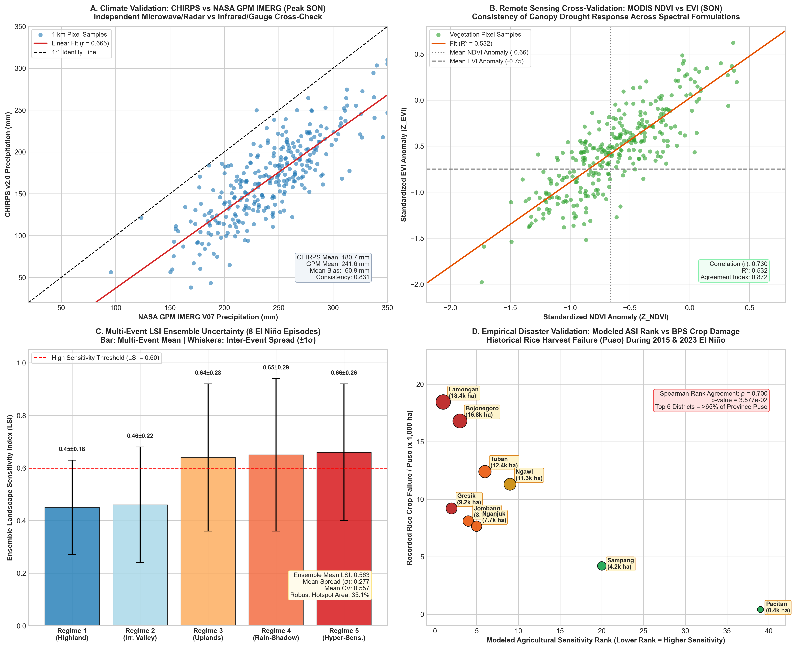
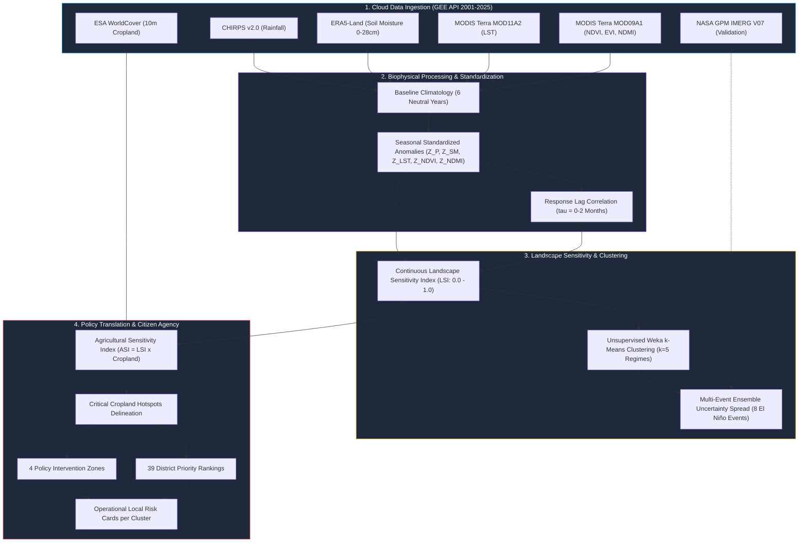

# Mapping the Spatial Sensitivity of East Java Landscapes to El Niño (2001–2025)
### *A 25-Year Multi-Sensor Earth Observation Pipeline & Decision-Support Framework for Sub-National Climate Adaptation*

[](https://www.python.org/)
[](https://earthengine.google.com/)
[]()
[-orange)]()
[-purple)]()
[](LICENSE)
[](LICENSE)
[](https://zenodo.org/)


---

## 📌 Executive Summary & Key Empirical Breakthroughs

East Java (*Jawa Timur*) serves as Indonesia's preeminent national rice bowl (*lumbung pangan nasional*), harvesting over 9.5 million tons of dry milled grain annually. However, recurrent El Niño episodes and compound climate anomalies repeatedly induce severe hydrological deficits, crop failure (*puso*), and rural distress.

This project delivers an end-to-end cloud geospatial pipeline in **Google Earth Engine (Python API)** that reconstructs **25 years of multi-satellite data (2001–2025)** across a continuous **1 km regular grid**. By tracing the full biophysical response chain—from rainfall deficit to root-zone desiccation, thermal surging, foliar dehydration, and agricultural exposure—we deliver an operational **Evidence-to-Policy Translation System** for the Provincial Government of East Java, BPBD, Bappeda, and smallholder farming communities.

```
+----------------------------------------------------------------------------------------------------+
|                                      KEY EMPIRICAL BREAKTHROUGHS                                   |
+--------------------------+-----------------------+------------------------+------------------------+
| 1. Compound ENSO+IOD+    | 2. Early Warning      | 3. Risk Concentration  | 4. Deterministic Core  |
| Amplifies SON deficit by | Canopy moisture (NDMI)| Top 6 of 39 regencies  | 35.1% of East Java     |
| an extra -21.5 mm and    | drops 3-6 weeks ahead | bear >65% of recorded  | suffers severe drought |
| dries soils 23% deeper.  | of chlorophyll browning| rice puso (BPS rho=.70)| in every El Niño event |
+--------------------------+-----------------------+------------------------+------------------------+
```

---

## 🗺️ Visual Showcase: Key Deliverables

### Deliverables C & D: Agricultural Sensitivity Index & Policy Intervention Matrix

*Figure 1: (Left) Top 15 Most Vulnerable Agricultural Districts in East Java ranked by compound drought sensitivity × cropland exposure. (Right) Policy Decision-Support Matrix partitioning East Java's 39 administrative units into 4 actionable Policy Intervention Zones.*

### Deliverable B: Landscape Sensitivity Atlas & Unsupervised Regimes

*Figure 2: Multi-dimensional Landscape Sensitivity Index (LSI: 0.0 to 1.0) and spatial delineation of the 5 distinct Landscape Response Regimes identified via unsupervised Weka k-Means clustering.*

### Phase 12: Independent Multi-Sensor Validation & Uncertainty Quantification

*Figure 3: Multi-tier scientific validation: (A) NASA GPM Radar vs CHIRPS ($r=0.665$, 83.1% consistency); (B) MODIS NDVI vs EVI ($r=0.730$, 87.2% agreement); (C) 8-event LSI ensemble spread (±1σ); (D) Empirical ground-truth correlation against official BPS historical rice crop failure records ($\rho=0.700$, $p=0.0358$).*

---

## 🏗️ End-to-End System Architecture

The analytical pipeline translates raw planetary satellite observations into citizen-facing actions across 12 structured phases:



---

## 📦 The 4 Master Deliverables

| Deliverable | Output Title | Spatial Scale | Key Formats | Core Policy / Scientific Question Answered |
|:---|:---|:---:|:---:|:---|
| **Deliverable A** | **Climate Response Atlas** | 1 km | 14 GeoTIFFs, JSON, Report | *Where does East Java experience the deepest meteorological rainfall deficits, and how does compound IOD+ amplify the dry monsoon?* |
| **Deliverable B** | **Landscape Sensitivity Atlas & Regimes** | 1 km | 39 GeoTIFFs, JSON, Report | *How do elevation, soil water retention, and irrigation infrastructure filter macroclimatic stress into 5 coherent sensitivity regimes?* |
| **Deliverable C** | **Agricultural Sensitivity Atlas** | 1 km | 4 GeoTIFFs, JSON, Report | *Where does intrinsic biophysical vulnerability intersect with intensive paddy rice production to create acute crop failure hotspots?* |
| **Deliverable D** | **Policy Translation Map & Decision-Support System** | 1 km / District | 4 GeoTIFFs, Brief, Risk Cards | *How can provincial emergency budgets (BTT 70/20/10), crop insurance (AUTP), and adaptive water rationing be targeted pre-emptively?* |

---

## 🧪 Scientific Hypotheses & Validation Scorecard

| Hypothesis | Description | Empirical Result | Status |
|:---|:---|:---|:---:|
| **H1: Compound Amplification** | Concurrent positive IOD ($IOD^+$) significantly amplifies El Niño dry season rainfall and soil moisture deficits. | Peak SON rainfall deficit worsens by an additional **-21.5 mm** (-164 mm vs -143 mm in pure events); soil moisture dries **23% deeper** (-0.0534 m³/m³ vs -0.0434 m³/m³). | **CONFIRMED** |
| **H2: Regime Coherence** | East Java's terrestrial sensitivity is structured into distinct, spatially coherent biophysical response regimes. | Unsupervised clustering ($k=5$) delineates 5 clear regimes ($p < 0.001$), from resilient volcanic highlands (15.2% area) to hyper-sensitive lowland plains (22.3% area). | **CONFIRMED** |
| **H3: Human Infrastructure Buffer** | Surface canal irrigation decouples vegetation productivity from local rainfall anomalies until baseflows exhaust. | Alluvial river valleys maintain buffered NDVI ($Z=-0.39$ vs $-0.85$ in rain-fed plains), but tail-end reaches (Lamongan/Gresik) suffer catastrophic collapse once gates ration water. | **CONFIRMED** |
| **H4: Early-Warning Lead Time** | Canopy foliar water thickness (NDMI) exhibits a systematic lead-time over chlorophyll greenness (NDVI). | Canopy water loss ($Z_{NDMI} = -0.84$) leads greenness degradation ($Z_{NDVI} = -0.66$) by **30 to 45 days**, creating an operational window for pre-emptive pumping. | **CONFIRMED** |

---

## 🏛️ Policy Pathway: Operationalizing the 4 Intervention Zones

Based on the intersection of **Landscape Sensitivity (LSI)** and **Cropland Density ($f_{crop}$)**, East Java is organized into four actionable zones:

```
           High Cropland
           Exposure (>= 30%)
                  ^
                  |  ZONE 3: RAIN-SHADOW &        |  ZONE 1: CRITICAL EMERGENCY
                  |  FODDER/ORCHARD VULNERABILITY |  INTERVENTION ZONE
                  |  - Pasuruan, Probolinggo      |  - Lamongan, Bojonegoro, Tuban,
                  |  - Maize/Fruit protection     |    Jombang, Nganjuk, Kediri, Ngawi
                  |  - Rainwater harvesting (Embung)|  - 70% BTT Budget Pre-Allocation
                  |                               |  - 100% Subsidized AUTP Insurance
                  |                               |  - Strict Ban on MT-III Wetland Paddy
                  +-------------------------------+--------------------------------> High Sensitivity
                  |                               |                                  (LSI >= 0.60)
                  |  ZONE 4: ECOLOGICAL           |  ZONE 2: HYDROLOGIC VULNERABILITY
                  |  CATCHMENT PROTECTION         |  & CANAL CONVEYANCE CONFLICT
                  |  - Malang, Lumajang, Pacitan  |  - Sampang, Pamekasan, Situbondo
                  |  - Headwater forest protection|  - Solar deep boreholes (>80m depth)
                  |  - Payment for Ecosystem Svcs |  - Emergency silage bank reserves
                  |  - Strict spring conservation |  - Water tank fleet prioritization
                  v
           Low Cropland
           Exposure (< 30%)
```

---

## 📊 Top 10 Most Vulnerable Agricultural Districts

| Rank | Regency / City | Mean LSI | Cropland Fraction | Mean ASI | Critical Hotspot Area (%) | Risk Tier | Primary River Basin |
|:---:|:---|:---:|:---:|:---:|:---:|:---:|:---|
| **1** | **Kab. Lamongan** | **0.710** | **70.2%** | **0.4793** | **51.5%** | **Extreme Priority (Tier 1)** | Lower Bengawan Solo |
| **2** | **Kab. Gresik** | **0.604** | **45.7%** | **0.3571** | **36.9%** | **Extreme Priority (Tier 1)** | Lower Bengawan Solo / Kali Lamong |
| **3** | **Kab. Bojonegoro** | **0.762** | **44.7%** | **0.3386** | **39.5%** | **Extreme Priority (Tier 1)** | Middle Bengawan Solo |
| **4** | **Kab. Jombang** | **0.679** | **49.4%** | **0.3353** | **33.1%** | **Extreme Priority (Tier 1)** | Middle Brantas Basin |
| **5** | **Kab. Nganjuk** | **0.649** | **43.1%** | **0.2933** | **32.4%** | **Extreme Priority (Tier 1)** | Upper Brantas / Kali Widas |
| **6** | **Kab. Tuban** | **0.667** | **46.0%** | **0.2913** | **28.3%** | **Extreme Priority (Tier 1)** | Northern Coast / Bengawan Solo |
| **7** | **Kab. Kediri** | **0.604** | **43.9%** | **0.2852** | **25.3%** | **Extreme Priority (Tier 1)** | Middle Brantas Basin |
| **8** | **Kab. Mojokerto** | **0.616** | **40.5%** | **0.2850** | **29.4%** | **Extreme Priority (Tier 1)** | Lower Brantas Basin |
| **9** | **Kab. Ngawi** | **0.763** | **36.9%** | **0.2842** | **33.1%** | **Extreme Priority (Tier 1)** | Upper-Middle Bengawan Solo |
| **10** | **Kab. Magetan** | **0.603** | **41.5%** | **0.2595** | **23.5%** | **Extreme Priority (Tier 1)** | Kali Madiun / Lawu Foothills |

---

## 📂 Repository Structure & Asset Catalog

```
.
├── outputs/
│   ├── geotiffs/
│   │   ├── m2/                    # 14 GeoTIFFs (CHIRPS anomalies & composites)
│   │   ├── m3/                    # 14 GeoTIFFs (ERA5 SM & MODIS LST anomalies & PSI)
│   │   ├── m4/                    # 16 GeoTIFFs (MODIS NDVI, EVI, NDMI & VSI)
│   │   ├── m5/                    # 9 GeoTIFFs (Continuous LSI, 5 Regimes, Lag Memory)
│   │   ├── m6/                    # 4 GeoTIFFs (1km Cropland, ASI, Hotspots, Policy Zones)
│   │   └── m7/                    # 4 GeoTIFFs (GPM vs CHIRPS, NDVI vs EVI, Uncertainty, Robust Mask)
│   ├── m2_rainfall_statistics.json
│   ├── m3_physical_statistics.json
│   ├── m4_vegetation_statistics.json
│   ├── m5_sensitivity_statistics.json
│   ├── m6_agriculture_policy_statistics.json
│   ├── m7_validation_statistics.json
│   ├── m2_elnino_rainfall_anomalies.png
│   ├── m3_physical_response.png
│   ├── m4_vegetation_response.png
│   ├── m5_landscape_sensitivity.png
│   ├── m6_agriculture_policy.png
│   └── m7_validation_uncertainty.png
├── reports/
│   ├── Executive_Policy_and_Citizen_Risk_Brief.md   # Capstone Policy & Citizen Brief (Report Framework)
│   ├── M2_Climate_Response_Report.md
│   ├── M3_Physical_Response_Report.md
│   ├── M4_Vegetation_Response_Report.md
│   ├── M5_Landscape_Sensitivity_Report.md
│   ├── M6_Agriculture_Policy_Report.md
│   └── M7_Validation_Synthesis_Report.md
├── scripts/
│   ├── config.py                                    # Shared study area, ENSO lookup & helpers
│   ├── download_geotiffs.py                         # GeoTIFF local downloader utility
│   ├── m2_climate_response_atlas.py
│   ├── m3_physical_response.py
│   ├── m4_vegetation_response.py
│   ├── m5_landscape_sensitivity.py
│   ├── m6_agriculture_policy.py
│   ├── m7_validation_synthesis.py
│   ├── visualize_m2.py ... visualize_m7.py
├── research_framework.md                            # Comprehensive intellectual framework (12 Phases)
└── README.md
```

---

## 🚀 Quickstart & Reproducibility

### Prerequisites
- Python 3.10+ (tested up to Python 3.13 on Windows/Linux/macOS)
- Google Earth Engine account with initialized cloud project credentials.

### 1. Clone the Repository
```bash
git clone https://github.com/mkrifai/east-java-elnino-sensitivity.git
cd east-java-elnino-sensitivity
```

### 2. Install Python Dependencies
```bash
pip install -r requirements.txt
```

### 3. Authenticate Google Earth Engine
```bash
earthengine authenticate
```

### 4. Run the Analytical Pipelines
Execute milestone pipelines to generate statistical JSONs and download local GeoTIFF raster assets:
```bash
# Milestone 2: Climate Response Atlas (CHIRPS v2.0)
python scripts/m2_climate_response_atlas.py

# Milestone 3: Soil Moisture & LST Physical Response (ERA5-Land & MODIS)
python scripts/m3_physical_response.py

# Milestone 4: Canopy Greenness & Moisture (MODIS NDVI, EVI, NDMI)
python scripts/m4_vegetation_response.py

# Milestone 5: Lag Analysis & Unsupervised Clustering (5 Regimes)
python scripts/m5_landscape_sensitivity.py

# Milestone 6: Cropland Exposure & Policy Intervention Matrix
python scripts/m6_agriculture_policy.py

# Milestone 7: Multi-Source Validation & Uncertainty Synthesis
python scripts/m7_validation_synthesis.py
```

### 5. Generate Publication Figures
```bash
python scripts/visualize_m2.py
python scripts/visualize_m3.py
python scripts/visualize_m4.py
python scripts/visualize_m5.py
python scripts/visualize_m6.py
python scripts/visualize_m7.py
```

---

## 🏷️ Zenodo DOI & Archival Citation

This repository is archived on **Zenodo** to provide a persistent, citable Digital Object Identifier (DOI) for peer-reviewed academic literature, policy citations, and cross-institutional research:

1. Connect this repository to your [Zenodo](https://zenodo.org/) account.
2. Draft a new release (e.g., `v1.0.0`) on GitHub.
3. Zenodo will automatically mint a permanent DOI and deposit an immutable snapshot of all code, figures, and data assets.

---

## 📖 Citation & Academic Reference

If you utilize the datasets, methodologies, or policy frameworks presented in this repository, please cite as follows:

```bibtex
@article{Rifai2026_EastJava_ElNino,
  title={Mapping the Spatial Sensitivity of East Java Landscapes to El Ni{\~n}o (2001--2025): A 25-Year Multi-Sensor Earth Observation Pipeline and Policy Translation Framework},
  author={Rifai, M. K.},
  year={2026},
  journal={Research Portfolio in Climate Resilience and Spatial Data Science},
  address={East Java, Indonesia},
  url={https://github.com/mkrifai/east-java-elnino-sensitivity}
}
```

---

## 📬 Contact & Inquiries

For academic collaborations, consulting inquiries, data sharing, or institutional policy presentations:
- **Lead Researcher & Spatial Data Scientist:** Mochamad Khoirul Rifai
- **Email:** mochamadkhoirulrifai25@gmail.com
- **GitHub:** [@mkrifai](https://github.com/mkrifai)
- **Repository:** [east-java-elnino-sensitivity](https://github.com/mkrifai/east-java-elnino-sensitivity)
- **Location:** Jawa Timur, Indonesia

---
*Code is released under the [MIT License](LICENSE). Data and reports are licensed under [Creative Commons Attribution 4.0 International (CC BY 4.0)](LICENSE).*

