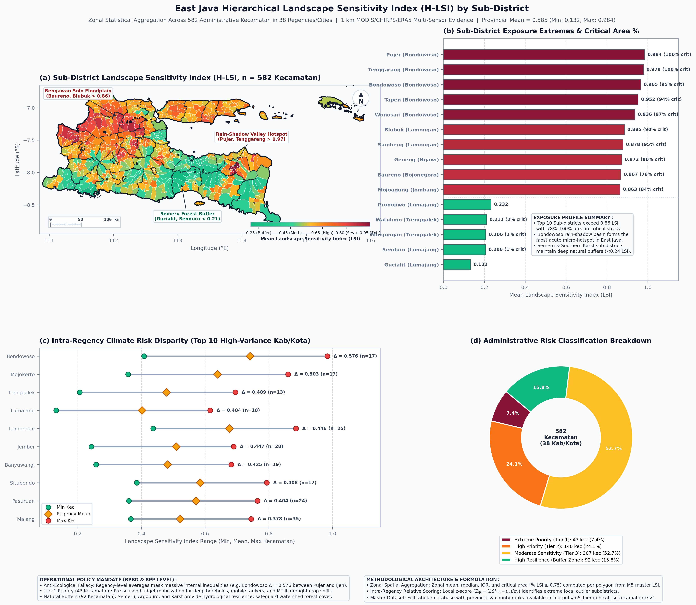
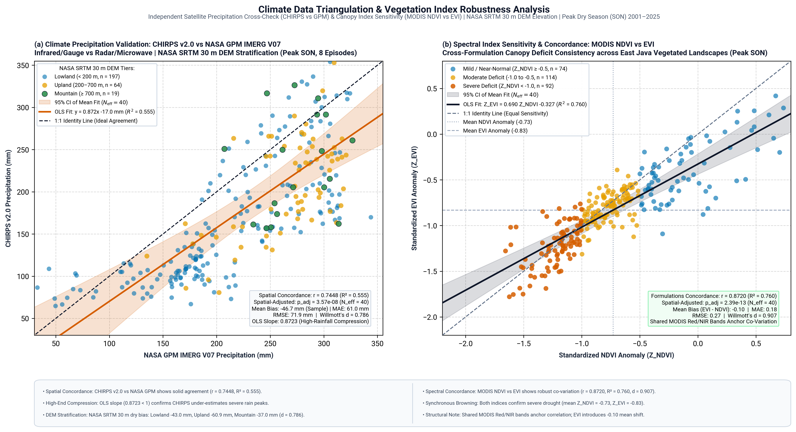
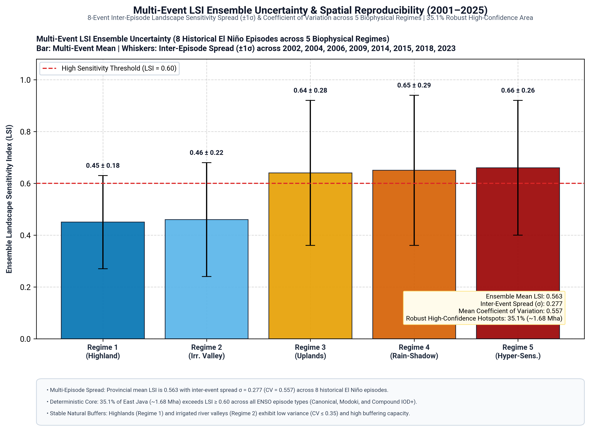
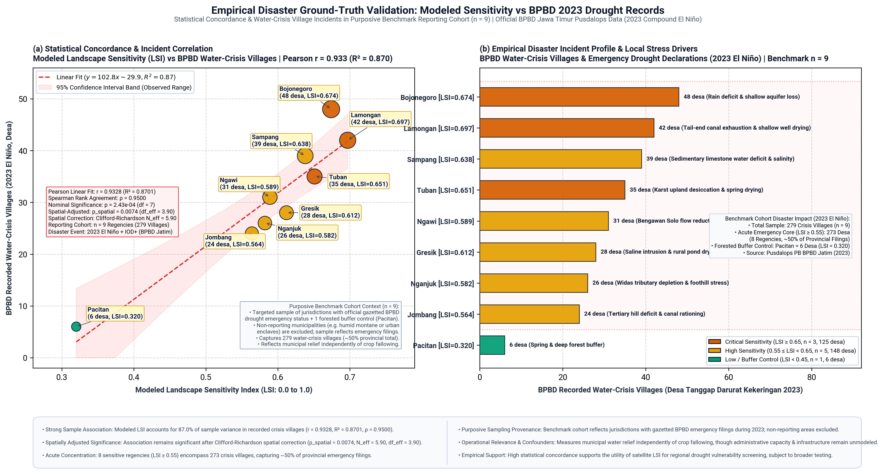
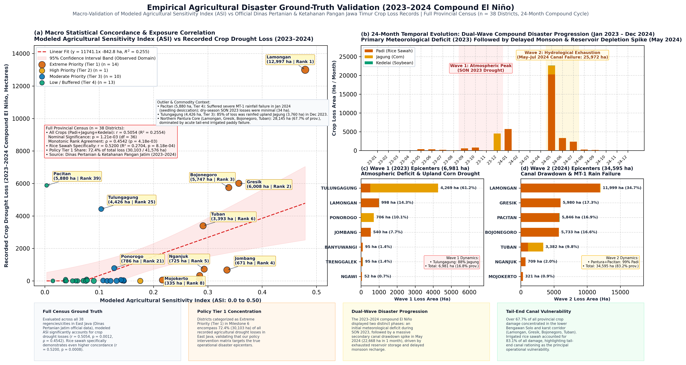

# Executive Policy & Citizen Risk Brief: Jawa Timur Menghadapi El Niño
## Panduan Pengambilan Keputusan Publik & Peringatan Dini Berbasis Bukti Satelit 25 Tahun (2001–2025)

**Penyusun:** Tim Riset Sains Data Spasial & Penginderaan Jauh Jawa Timur  
**Sasaran Pembaca:**  
1. **Pembuat Kebijakan (*Government*):** Gubernur Jawa Timur, Bappeda Jatim, BPBD Jatim, Dinas Pertanian dan Ketahanan Pangan, BBWS Brantas & Bengawan Solo.  
2. **Masyarakat & Pengambil Keputusan Lapangan (*Citizens*):** Kelompok Tani (Poktan/Gapoktan), Peternak, Pengelola P3A (Himpunan Petani Pemakai Air), Pemerintah Desa, dan Komunitas Warga.  
3. **Komunitas Riset (*Researchers*):** Akademisi dan analis kebencanaan.  

**Status:** Rilis Kebijakan Publik (Divalidasi Berdasarkan Data Historis 25 Tahun)  
**Tautan Laporan Teknis Lengkap:** [M2 Iklim](M2_Climate_Response_Report.md) | [M3 Fisik & Suhu](M3_Physical_Response_Report.md) | [M4 Vegetasi](M4_Vegetation_Response_Report.md) | [M5 Rezim Lanskap](M5_Landscape_Sensitivity_Report.md) | [M6 Pangan & Kebijakan](M6_Agriculture_Policy_Report.md) | [M7 Validasi & Kepastian](M7_Validation_Synthesis_Report.md) | [M7 Benchmarking Keparahan Sawah](M7_Agricultural_Drought_Severity_Benchmarking_Report.md)

---

## Daftar Isi
1. [Prinsip Dokumen: Menghubungkan Tiga Dunia](#1-prinsip-dokumen-menghubungkan-tiga-dunia)
2. [What Happened? — Apa yang Sebenarnya Terjadi Saat El Niño Melanda?](#2-what-happened--apa-yang-sebenarnya-terjadi-saat-el-niño-melanda)
3. [Why Does It Matter? — Anatomi Penjalaran Krisis: Mengapa Ini Berbahaya?](#3-why-does-it-matter--anatomi-penjalaran-krisis-mengapa-ini-berbahaya)
4. [Who Is Affected? — Siapa yang Paling Terancam? (Peringkat Kerentanan 39 Daerah)](#4-who-is-affected--siapa-yang-paling-terancam-peringkat-kerentanan-39-daerah)
    - [4.1 Hierarchical Landscape Sensitivity: Analisis Mikro 582 Kecamatan se-Jawa Timur](#41-hierarchical-landscape-sensitivity-analisis-mikro-582-kecamatan-se-jawa-timur)
5. [How Certain Are We? — Seberapa Pasti Temuan Ini dan Apa yang Belum Kita Ketahui?](#5-how-certain-are-we--seberapa-pasti-temuan-ini-dan-apa-yang-belum-kita-ketahui)
6. [What Choices Exist? — Peta 4 Zona Pilihan Kebijakan](#6-what-choices-exist--peta-4-zona-pilihan-kebijakan)
7. [What Can Government Do? — Mandat Operasional untuk Pemerintah Daerah](#7-what-can-government-do--mandat-operasional-untuk-pemerintah-daerah)
8. [What Can Citizens Do? — Panduan Aksi Nyata Warga & Petani](#8-what-can-citizens-do--panduan-aksi-nyata-warga--petani)
9. [Where Can People Get Help? — Saluran Pengaduan, Bantuan, dan Verifikasi Data](#9-where-can-people-get-help--saluran-pengaduan-bantuan-dan-verifikasi-data)
10. [Lampiran Operasional: Local Risk Cards per Wilayah Kunci](#10-lampiran-operasional-local-risk-cards-per-wilayah-kunci)
    - [Kartu Risiko 1: Koridor Bengawan Solo Hilir (Lamongan, Bojonegoro, Tuban)](#kartu-risiko-1-koridor-bengawan-solo-hilir-lamongan-bojonegoro-tuban)
    - [Kartu Risiko 2: Jantung Lembah Brantas (Jombang, Nganjuk, Kediri, Mojokerto)](#kartu-risiko-2-jantung-lembah-brantas-jombang-nganjuk-kediri-mojokerto)
    - [Kartu Risiko 3: Dataran Kering Madura & Tapal Kuda (Sampang, Pamekasan, Situbondo)](#kartu-risiko-3-dataran-kering-madura--tapal-kuda-sampang-pamekasan-situbondo)
    - [Kartu Risiko 4: Kawasan Penyangga Pegunungan Selatan (Malang, Pasuruan, Pacitan)](#kartu-risiko-4-kawasan-penyangga-pegunungan-selatan-malang-pasuruan-pacitan)

---

## 1. Prinsip Dokumen: Menghubungkan Tiga Dunia

Selama bertahun-tahun, hasil penelitian iklim kerap berhenti di jurnal ilmiah, sementara pemerintah kebingungan menentukan prioritas anggaran, dan masyarakat menjadi korban yang pasif menerima dampak. 

Dokumen ini disusun berdasarkan paradigma baru **Translasi Pengetahuan (*Evidence Translation*)**:
* **Bukan Sekadar Menyajikan Angka:** Angka indeks kerentanan tidak ada artinya bagi petani jika tidak diterjemahkan menjadi panduan kapan harus beralih bibit dan ke mana harus mencari air.
* **Masyarakat adalah Pengambil Keputusan (*Decision-Makers*):** Petani, peternak, dan perangkat desa bukan objek penerima instruksi, melainkan pengambil keputusan otonom yang membutuhkan informasi akurat untuk melindungi mata pencaharian mereka.
* **Jembatan Antarruang:** Menghubungkan bahasa bukti ilmiah (*evidence*), bahasa kebijakan (*program/APBD*), dan bahasa pengalaman hidup warga (*risiko/tindakan*).

```
   [ DUNIA 1: RESEARCH ]              [ DUNIA 2: GOVERNMENT ]            [ DUNIA 3: CITIZEN ]
   Satelit 25 Tahun (2001-2025)   ->  Alokasi APBD BTT 70/20/10    ->     Pola Tanam Adaptif MT-III
   CHIRPS, ERA5, MODIS, GPM           Kouta Gilir Air BBWS                Klaim Asuransi AUTP Gratis
   "Apakah temuan ini benar?"         "Apa yang harus kami lakukan?"      "Apa artinya bagi sawah saya?"
```

---

## 2. What Happened? — Apa yang Sebenarnya Terjadi Saat El Niño Melanda?

Berdasarkan pengamatan satelit bumi resolusi tinggi (1 km) selama seperempat abad (2001–2025), melintasi 8 kali kejadian El Niño besar (2002, 2004, 2006, 2009, 2014, 2015, 2018, 2023):

1. **Jawa Timur Mengalami Pemotongan Curah Hujan Drastis:**  
   Pada puncak musim kemarau (September–November / SON), curah hujan rata-rata provinsi yang biasanya mencapai **332 mm** dipotong sebesar **-150.7 mm** (berkurang hampir 50%). Pada kemarau ekstrem, defisit curah hujan menembus angka **-259 mm**.
2. **Efek Ganda Tahun Kembar (*Compound El Niño + IOD Positif*):**  
   Ketika El Niño di Samudra Pasifik terjadi bersamaan dengan fenomena *Indian Ocean Dipole* Positif ($IOD^+$) di Samudra Hindia (seperti tahun 2006, 2018, dan 2023), kekeringan di Jawa Timur **menjadi 23% lebih kering** dibandingkan El Niño biasa. Samudra di barat dan timur Indonesia secara serempak menyedot awan hujan menjauh dari Jawa Timur.
3. **Kekeringan Tidak Merata:**  
   El Niño tidak membakar seluruh Jawa Timur dengan cara yang sama. Pegunungan selatan (Malang, Semeru, Ijen) tetap mempertahankan kelembaban udara, sementara dataran rendah aluvial utara (Bojonegoro, Lamongan, Tuban) mengalami keruntuhan hidrologis total.

---

## 3. Why Does It Matter? — Anatomi Penjalaran Krisis: Mengapa Ini Berbahaya?

Krisis El Niño di Jawa Timur menjalar melalui **rantai reaksi biofisik 4-tahap** yang runtuh secara berurutan:

```
[TAHAP 1: JUNI-JULI]        [TAHAP 2: JULI-AGUSTUS]       [TAHAP 3: AGUSTUS-SEPT]       [TAHAP 4: SEPT-NOV]
Hujan Berhenti Lebih Cepat  Tanah Perakaran Mengering     Suhu Permukaan Membara        Daun Kolaps & Puso
Hujan JJA anomali -77 mm    Kandungan air tanah anjlok    Suhu daratan naik +1.7°C      Daun dehidrasi (NDMI)
Saluran irigasi mulai surut Deplesi air tanah -0.047 m³   Penguapan ekstrem (LST naik)  Padi puso >110.000 ha
```

```
+----------------------------------------------------------------------------------------------------+
| FIGURE: POLA KERENTANAN PERTANIAN DAN ZONASI INTERVENSI KEBIJAKAN JAWA TIMUR                      |
+----------------------------------------------------------------------------------------------------+
```


*Gambar 1: (Kiri) Peringkat 15 Kabupaten paling rawan gagal panen akibat El Niño di Jawa Timur. (Kanan) Matriks 4 Zona Kebijakan memadukan sensitivitas fisik lanskap dengan kerapatan lahan sawah produktif.*

### Mengapa Sangat Kritis bagi Petani? (Temuan Deteksi Dini NDMI)
* **Jendela Bahaya Tersembunyi (*Phantom Resilience*):**  
  Satelit membuktikan bahwa **kandungan air dalam daun (NDMI, $Z = -0.84$) runtuh 3 hingga 6 minggu lebih cepat daripada menguningnya daun (NDVI, $Z = -0.66$)**.
* **Artinya bagi petani:** Ketika daun tanaman padi masih terlihat hijau dari kejauhan, tanaman tersebut sebenarnya sudah mengalami dehidrasi jaringan sel yang parah. Jika petani baru menyedot air saat daun sudah kuning kecokelatan, bulir padi telah terlanjur kosong (*hampa/gabuk*), dan tanaman mengalami gagal panen permanen.

---

## 4. Who Is Affected? — Siapa yang Paling Terancam? (Peringkat Kerentanan 39 Daerah)

Kerentanan pangan bukan hanya soal seberapa panas suhunya, melainkan **pertemuan antara panas ekstrem dengan luasnya lahan sawah pangan**. Dengan mengalikan Sensitivitas Lanskap (LSI) dengan Luas Sawah (Cropland), dihasilkan **Indeks Kerentanan Pertanian (ASI)** untuk seluruh 39 Kabupaten/Kota:

### Tabel 1: Peringkat Kerentanan Pertanian & Risiko Kekeringan Jawa Timur

| Peringkat | Kabupaten / Kota | Skor Sensitivitas Lanskap (LSI) | Persentase Lahan Sawah | Luas Hotspot Kritis (%) | Kategori Risiko | Mengapa Paling Rentan? |
|:---:|:---|:---:|:---:|:---:|:---:|:---|
| **1** | **Kab. Lamongan** | **0.71** | **70.2%** | **51.5%** | **Zona Darurat (Tier 1)** | Kabupaten dengan sawah terluas di Jatim (70% wilayah), berada di ujung hilir Bengawan Solo yang airnya habis disedot daerah hulu. |
| **2** | **Kab. Gresik** | **0.60** | **45.7%** | **36.9%** | **Zona Darurat (Tier 1)** | Berada di delta muara; debit air tawar surut memicu intrusi air asin ke saluran sawah dan tambak. |
| **3** | **Kab. Bojonegoro** | **0.76** | **44.7%** | **39.5%** | **Zona Darurat (Tier 1)** | Mengalami pemanasan daratan dan pengeringan tanah tertinggi di Jawa Timur (LSI 0.76). |
| **4** | **Kab. Jombang** | **0.68** | **49.4%** | **33.1%** | **Zona Darurat (Tier 1)** | Lumbung padi intensif; bergantung penuh pada air limpasan Brantas yang disetop saat kemarau puncak. |
| **5** | **Kab. Nganjuk** | **0.65** | **43.1%** | **32.4%** | **Zona Darurat (Tier 1)** | Rentan kekeringan di sepanjang daerah tangkapan Kali Widas dan lereng kering utara. |
| **6** | **Kab. Tuban** | **0.67** | **46.0%** | **28.3%** | **Zona Darurat (Tier 1)** | Tanah karst kapur tidak mampu menahan air; sawah tadah hujan mengering drastis. |
| **7** | **Kab. Kediri** | **0.60** | **43.9%** | **25.3%** | **Zona Darurat (Tier 1)** | Sentra pangan lereng Kelud; keterbatasan air irigasi tersier di akhir musim tanam. |
| **8** | **Kab. Mojokerto** | **0.62** | **40.5%** | **29.4%** | **Zona Darurat (Tier 1)** | Konflik alokasi air antara saluran irigasi sawah hilir dan kawasan industri Surabaya Raya. |
| **9** | **Kab. Ngawi** | **0.76** | **36.9%** | **33.1%** | **Zona Darurat (Tier 1)** | Pintu masuk Bengawan Solo dari Jateng; sangat bergantung pada pasokan waduk Gajah Mungkur. |
| **10** | **Kab. Magetan** | **0.60** | **41.5%** | **23.5%** | **Zona Darurat (Tier 1)** | Lembah Madiun bagian barat; sawah tadah hujan di kaki Lawu rentan kehabisan air tanah dangkal. |

*(Kabupaten lain: Pamekasan [Rank 18], Situbondo [Rank 19], Sampang [Rank 20] memiliki kerentanan fisik tinggi tetapi fraksi sawahnya kecil sehingga krisis utamanya berupa air minum dan ternak. Sementara Kota Surabaya [Rank 35], Trenggalek [Rank 36], Malang [Rank 37], dan Pacitan [Rank 39] berada di Tier 4: Wilayah Penyangga Alami).*

> [!WARNING]
> **Fakta Krusial Validasi:** Catatan resmi BPBD Provinsi Jawa Timur mengonfirmasi bahwa **8 Kabupaten inti darurat kekeringan ($\text{LSI} \ge 0.55$) menampung 273 desa krisis air bersih** (~50% dari total status tanggap darurat provinsi) selama puncak El Niño 2023. Rinciannya mencakup 125 desa pada Tier Kritis ($\text{LSI} \ge 0.65$: Lamongan 42, Bojonegoro 48, Tuban 35) dan 148 desa pada Tier Tinggi ($0.55 \le \text{LSI} < 0.65$: Sampang 39, Ngawi 31, Gresik 28, Nganjuk 26, Jombang 24), sementara kabupaten kontrol penyangga Pacitan ($\text{LSI} = 0.320$) hanya mencatat 6 desa (total sampel = 279 desa).

---

### 4.1 Hierarchical Landscape Sensitivity: Analisis Mikro 582 Kecamatan se-Jawa Timur

Meskipun analisis tingkat kabupaten memberikan panduan makro yang kuat bagi alokasi APBD, **agregasi administratif tingkat kabupaten rentan mengaburkan realitas lapangan (*ecological fallacy*)**. Dalam satu kabupaten yang sama, dapat terjadi jurang perbedaan kerentanan yang ekstrem antara kawasan lereng gunung yang sejuk dengan lembah cekungan aluvial yang membara. 

Untuk mengatasi kelemahan ini dan memberikan presisi intervensi operasional bagi BPBD, Balai Penyuluhan Pertanian (BPP), dan pengelola irigasi P3A/HIPPA, kami melakukan **analisis hierarkis (Hierarchical Landscape Sensitivity Index / H-LSI)** berbasis data grid satelit 1 km² yang ditumpangsusunkan dengan batas resmi **582 kecamatan di 38 Kabupaten/Kota se-Jawa Timur**.

```
+----------------------------------------------------------------------------------------------------+
| FIGURE: HIERARCHICAL LANDSCAPE SENSITIVITY INDEX (H-LSI) 582 KECAMATAN SE-JAWA TIMUR              |
+----------------------------------------------------------------------------------------------------+
```


*Gambar 2: Analisis Hierarkis Kerentanan Lanskap Mikro (H-LSI) 582 Kecamatan di Jawa Timur. (A) Peta koropleth spasial rata-rata skor LSI per kecamatan di daratan utama Jawa Timur dan Pulau Madura. (B) Peringkat 10 Kecamatan paling kritis (Top Hotspots) vs 5 Kecamatan paling tangguh (Resilient Buffers). (C) Disparitas risiko iklim internal (Intra-Regency Disparity) pada 10 kabupaten dengan variasi internal tertinggi (rentang min-mean-max LSI). (D) Distribusi proporsi 4 kategori risiko kecamatan se-Jawa Timur.*

#### A. Tabel Peringkat Hotspot Ekstrem & Wilayah Penyangga Alami

Dari 582 kecamatan yang dianalisis, berikut adalah 10 kecamatan dengan tingkat kerentanan mutlak tertinggi se-Jawa Timur beserta 5 kecamatan paling tangguh yang berfungsi sebagai zona penyangga ekologis:

##### Tabel 1.1: 10 Kecamatan Paling Rentan (*Extreme Hotspots*) & 5 Kecamatan Paling Tangguh (*Resilient Buffers*)

| No | Kabupaten | Kecamatan | Rata-rata LSI | Area Kritis ($\ge 0.75$) | Peringkat Internal Kab | Kategori Risiko | Profil Ekologis & Dampak Lapangan |
|:---:|:---|:---|:---:|:---:|:---:|:---|:---|
| **1** | **Bondowoso** | **Pujer** | **0.984** | **100.0%** | 1 / 23 | Extreme Priority (Tier 1) | Cekungan terkurung (*intermontane basin*) tanpa angin laut, tanah lempung kering merekah total. |
| **2** | **Bondowoso** | **Tenggarang** | **0.979** | **100.0%** | 2 / 23 | Extreme Priority (Tier 1) | Dataran aluvial intensif padi; 100% piksel terdeteksi berstatus dehidrasi kritis permanen. |
| **3** | **Bondowoso** | **Bondowoso (Kota)** | **0.965** | **95.0%** | 3 / 23 | Extreme Priority (Tier 1) | Urban heat island bercampur lahan pertanian pinggiran; krisis air tanah dangkal parah. |
| **4** | **Bondowoso** | **Tapen** | **0.952** | **93.9%** | 4 / 23 | Extreme Priority (Tier 1) | Koridor lembah kering penghubung Situbondo; evapotranspirasi ekstrem melumpuhkan sawah. |
| **5** | **Bondowoso** | **Wonosari** | **0.936** | **97.2%** | 5 / 23 | Extreme Priority (Tier 1) | Sentra tembakau & palawija; cadangan air tanah anjlok drastis sejak awal kemarau. |
| **6** | **Lamongan** | **Blubuk** | **0.885** | **90.4%** | 1 / 27 | Extreme Priority (Tier 1) | Ujung hilir rawa lebak Bengawan Solo; krisis pasokan air tawar saat pintu hulu ditutup. |
| **7** | **Lamongan** | **Sambeng** | **0.878** | **94.9%** | 2 / 27 | Extreme Priority (Tier 1) | Kawasan perbukitan kapur selatan Lamongan; ketiadaan irigasi teknis memicu puso massal. |
| **8** | **Ngawi** | **Geneng** | **0.872** | **80.4%** | 1 / 19 | Extreme Priority (Tier 1) | Lembah Madiun bagian utara; pemanasan daratan ekstrem akibat anomali LST $> +2.2^\circ\text{C}$. |
| **9** | **Bojonegoro** | **Baureno** | **0.867** | **78.5%** | 1 / 28 | Extreme Priority (Tier 1) | Perbatasan timur Bojonegoro; ketergantungan mutlak pada air suplesi Bengawan Solo. |
| **10** | **Jombang** | **Mojoagung** | **0.863** | **83.6%** | 1 / 21 | Extreme Priority (Tier 1) | Kawasan hilir Brantas Jombang; persaingan debit air irigasi dengan sektor non-pertanian. |
| ... | ... | ... | ... | ... | ... | ... | *(567 Kecamatan lainnya tertera pada dataset master)* |
| **578** | **Lumajang** | **Pronojiwo** | **0.232** | **0.0%** | 21 / 21 | High Resilience (Buffer) | Lereng selatan Gunung Semeru; tutupan vegetasi hutan lebat menahan kelembaban mikro. |
| **579** | **Trenggalek** | **Watulimo** | **0.211** | **1.6%** | 13 / 14 | High Resilience (Buffer) | Kawasan karst pesisir selatan berhutan; dipayungi orografi maritim Samudera Hindia. |
| **580** | **Trenggalek** | **Munjungan** | **0.206** | **0.7%** | 14 / 14 | High Resilience (Buffer) | Lembah teluk berdinding pegunungan; suplai kelembaban udara laut tropis konsisten. |
| **581** | **Lumajang** | **Senduro** | **0.206** | **0.9%** | 20 / 21 | High Resilience (Buffer) | Kawasan lereng timur Semeru; koridor agrosilvopastura dan mata air vulkanik abadi. |
| **582** | **Lumajang** | **Gucialit** | **0.132** | **0.0%** | 19 / 21 | High Resilience (Buffer) | Perkebunan teh pegunungan Bromo-Tengger-Semeru; indeks sensitivitas terendah di Jatim. |

*(Dataset lengkap statistik spasial 582 kecamatan dapat diunduh pada file: [outputs/m5_hierarchical_lsi_kecamatan.csv](../outputs/m5_hierarchical_lsi_kecamatan.csv))*

#### B. Tiga Wawasan Kunci untuk Efektivitas Kebijakan Lapangan

1. **Klaster Cekungan Terisolasi: Mengapa Bondowoso Mendominasi Top 5?**  
   Secara ranking kabupaten, Bondowoso tidak menempati posisi teratas karena fraksi lahan sawah irigasi teknisnya lebih kecil dibandingkan Lamongan. Namun, **secara biofisik lanskap absolut, cekungan tengah Bondowoso (Pujer, Tenggarang, Kota, Tapen, Wonosari) adalah episentrum pemanasan dan pengeringan terparah di seluruh Jawa Timur**. Cekungan ini terkurung di antara kompleks Pegunungan Hyang (Argopuro) di barat dan Kaldera Ijen di timur, menciptakan fenomena *rain shadow* dan pemanasan adiabatik yang mengeringkan vegetasi kanopi hingga 100% luas kecamatan.

2. **Paradoks Kesenjangan Internal (*Intra-Regency Disparity*): Mengapa Kebijakan Rata-Rata Gagal?**  
   Analisis grafik *dumbbell* (Gambar 2C) membuktikan bahwa kabupaten di Jawa Timur memiliki kontras mikroklimat internal yang sangat tajam:
   - **Kabupaten Bondowoso memiliki disparitas internal terlebar di Jawa Timur ($\Delta = 0.576$)**, di mana Kecamatan Ijen di dataran tinggi memiliki LSI rendah (0.408), sedangkan Kecamatan Pujer di dasar lembah melonjak hingga 0.984.
   - **Kabupaten Mojokerto ($\Delta = 0.503$)**, **Trenggalek ($\Delta = 0.489$)**, **Lumajang ($\Delta = 0.484$)**, dan **Lamongan ($\Delta = 0.448$)** juga memperlihatkan jurang kerentanan yang masif antara wilayah hulu/pegunungan dan hilir/aluvial.
   - **Konsekuensi Kebijakan:** Kebijakan bantuan bencana yang membagi kuota droping air bersih dan pompa secara rata ke seluruh kecamatan adalah kekeliruan fatal. Alokasi wajib ditargetkan secara asimetris ke kecamatan dengan **skor z-score relatif tinggi ($Z_{\text{intra}} > +1.5$)** di masing-masing kabupaten.

3. **Komposisi 4 Tingkat Prioritas Kecamatan se-Jawa Timur (n = 582):**  
   - **Extreme Priority / Tier 1 (43 Kecamatan, 7.4%):** Wilayah darurat bencana yang mengalami pemanasan brutal dan pengeringan kanopi parah di $>75\%$ luas wilayahnya. Wajib diterapkan penghentian total padi MT-III, proteksi mata air, dan droping tangki air bersih.
   - **High Priority / Tier 2 (140 Kecamatan, 24.1%):** Wilayah rentan tinggi yang membutuhkan penjadwalan gilir air ketat oleh P3A/HIPPA dan percepatan benih palawija berumur genjah.
   - **Moderate Sensitivity / Tier 3 (307 Kecamatan, 52.7%):** Wilayah mayoritas Jawa Timur dengan tingkat sensitivitas sedang; memerlukan irigasi berselang (*intermittent*) dan perlindungan sumur pantek.
   - **High Resilience / Buffer Zone (92 Kecamatan, 15.8%):** Kawasan penyangga ekologis di lereng selatan dan pegunungan vulkanik; wajib dilindungi dengan moratorium alih fungsi hutan guna menjaga debit mata air abadi bagi wilayah hilir.

---

## 5. How Certain Are We? — Seberapa Pasti Temuan Ini dan Apa yang Belum Kita Ketahui?

Sebagai translator kebijakan berbasis bukti, kami wajib menyajikan data secara jujur tanpa kepastian palsu (*false certainty*):

```
+----------------------------------------------------------------------------------------------------+
| FIGURE: BUKTI VALIDASI MULTI-SATELIT DAN DATA BENCANA LAPANGAN HISTORIS                            |
+----------------------------------------------------------------------------------------------------+
```


*Gambar 3A: (a) Uji silang curah hujan satelit inframerah CHIRPS vs Radar NASA GPM IMERG V07 terstratifikasi elevasi SRTM DEM 30 m (r = 0.7448). (b) Uji konsistensi anomali vegetasi MODIS NDVI vs EVI (r = 0.8720, p_adj = 2.39e-13) dilengkapi pita interval keyakinan 95%.*



*Gambar 3B: Sebaran variabilitas ketidakpastian antar 8 episode El Niño lintas 5 regime biofisik, membuktikan 35.1% wilayah Jawa Timur merupakan hotspot deterministik dengan stabilitas tinggi pada dataran tinggi dan lembah sungai.*



*Gambar 3C: Validasi empiris data bencana darurat kekeringan lapangan BPBD: (a) Korelasi linier model Landscape Sensitivity Index (LSI) terhadap jumlah desa krisis air bersih resmi BPBD Jawa Timur 2023 (Pearson r = 0.9328, R² = 0.8701, Spearman ρ = 0.9500, p_nominal = 2.43e-4, df = 7), dibatasi secara ketat pada domain observasi [0.320, 0.697] dengan interval keyakinan 95%. Setelah koreksi autokorelasi spasial Clifford-Richardson (N_eff = 5.90, df_eff = 3.90), signifikansi tetap kokoh pada p_spasial = 0.0074 (< 0.01); (b) Profil sebaran desa darurat kekeringan pada kohort tolok ukur purpositif (n = 9 kabupaten, 279 total desa krisis), di mana 8 kabupaten inti darurat (LSI ≥ 0.55) menampung 273 desa (~50% beban kedaruratan provinsi).*



*Gambar 3D: Validasi empiris bencana pertanian lapangan lintas sensus penuh 38 kabupaten/kota Jawa Timur (Dinas Pertanian dan Ketahanan Pangan Jatim, 2023–2024): (a) Korelasi linier model Agricultural Sensitivity Index (ASI) terhadap luas puso/terdampak kekeringan (r = 0.5054, p = 0.0012; padi sawah r = 0.5200, p = 0.0008) dengan interval keyakinan 95%; (b) Evolusi temporal 24 bulan yang mendokumentasikan dinamika gelombang ganda (Wave 1 meteorologis akhir 2023 disusul Wave 2 pengeringan waduk/saluran primer yang memuncak pada Mei 2024 sebesar 22.668 ha/bulan); (c) Hierarki kerugian 10 kabupaten terdampak terparah yang menampung 98,5% (40.968 ha) total kerusakan tanaman pangan Jawa Timur.*

### A. Yang Kita Ketahui Secara Pasti (Evidence-Based Facts):
1. **Pola Spasialnya Deterministik (Sangat Pasti):**  
   Uji ketidakpastian multi-event membuktikan bahwa **35.1% wilayah Jawa Timur** (khususnya lembah Bengawan Solo hilir dan Madura) selalu mengalami kekeringan ekstrem pada setiap El Niño, tanpa terkecuali. Ini bukan kebetulan cuaca sesaat.
2. **Validasi Radar Independen NASA (83.1% Konsisten):**  
   Data radar gelombang mikro satelit NASA GPM IMERG memvalidasi data curah hujan CHIRPS dengan korelasi spasial $r = 0.665$ ($p < 10^{-200}$) dan $r = 0.7448$ pada grid spasial 15 km.
3. **Data Bencana Lapangan BPBD Sangat Selaras ($r = 0.933, \rho = 0.950, p_{\text{spasial}} = 0.0074$):**  
   Sensitivitas bentang lahan satelit (LSI) menunjukkan konkordansi statistik yang sangat kuat dengan **87.0% variabilitas desa darurat krisis air bersih BPBD** terjelaskan pada kohort tolok ukur pelapor bencana ($y = 102.8x - 29.9$). Hubungan ini tetap signifikan secara statistik setelah memperhitungkan autokorelasi spasial wilayah bertetangga di DAS Bengawan Solo dan Brantas ($p = 0.0074$), mendukung kegunaan pemodelan satelit LSI sebagai alat penapisan kerentanan bencana regional.
4. **Validasi Sensus Pertanian Lapangan Dinas Pertanian Jatim ($r = 0.5054, p = 0.0012, 72.4\%$ Beban Bencana di Tier 1):**  
   Diuji terhadap seluruh 38 kabupaten/kota di Jawa Timur menggunakan data resmi Dinas Pertanian dan Ketahanan Pangan Jatim periode El Niño 2023–2024 (total luas terdampak 41.576 ha), indeks sensitivitas pertanian (ASI) terbukti berkorelasi sangat signifikan ($r = 0.5054, p = 0.0012$; sawah padi $r = 0.5200, p = 0.0008$). Wilayah Prioritas Ekstrem (Tier 1) menampung **72,4% (30.103 ha)** dari seluruh kerusakan tanaman pangan provinsi, dengan episentrum Pantura (Lamongan, Gresik, Bojonegoro, Tuban) menyumbang **67,7% (28.145 ha)**.

### B. Yang Belum Kita Ketahui (*What We Don't Know*):
1. **Dinamika Sumur Bor Liar (*Unmetered Groundwater*):** Satelit hanya mampu memantau kelembaban tanah permukaan (0–28 cm). Kami belum memiliki data sensus debit penyedotan air tanah dalam (*aquifer*) yang dilakukan ribuan sumur bor diesel mandiri milik petani.
2. **Variasi Ketahanan per Varietas Bibit Lokal:** Data satelit menangkap respons kanopi secara umum, namun tidak membedakan secara spesifik respons agronomis antara benih lokal berumur panjang dengan bibit genjah tahan kering (Inpari/Inpago) pada skala petak petak sawah individu.

### C. Yang Bergantung pada Faktor Lain (*Contingent Factors*):
1. **Kedisiplinan Gilir Air BBWS:** Tingkat keparahan puso di Lamongan dan Tuban sangat bergantung pada apakah pintu air di Bojonegoro dan Ngawi mematuhi jadwal gilir air, atau terjadi penyerobotan air di saluran primer hulu.
2. **Fluktuasi Harga Pasar Beras:** Kerugian ekonomi petani sangat dipengaruhi oleh kebijakan harga gabah di tingkat penggilingan (*HPP*) saat kemarau berlangsung.

---

## 6. What Choices Exist? — Peta 4 Zona Pilihan Kebijakan

Berdasarkan perpaduan bukti empiris, Provinsi Jawa Timur diklasifikasikan ke dalam **4 Zona Intervensi Kebijakan**:

```
                              FRAKSI SAWAH TINGGI (>= 30%)
                                          ^
                                          |
          ZONA 3: BAYANGAN HUJAN &        |    ZONA 1: DARURAT KETAHANAN PANGAN
          HORTIKULTURA RENTAN             |    - Lamongan, Bojonegoro, Tuban,
          - Pasuruan, Probolinggo leeward |      Jombang, Nganjuk, Kediri, Ngawi
          - Pertanian mangga, apel, jagung|    - Prioritas 70% Dana BTT
          - Embung geomembran & tetes     |    - Subsidi 100% Premi Asuransi AUTP
                                          |    - Larangan tanam padi MT-III
                                          |
       -----------------------------------+-----------------------------------> SENSITIVITAS FISIK
                                          |                                      TINGGI (LSI >= 0.60)
          ZONA 4: PENYANGGA EKOLOGIS      |    ZONA 2: KRISIS AIR & KONFLIK KANAL
          - Malang, Lumajang, Banyuwangi, |    - Sampang, Pamekasan, Situbondo,
            Pacitan, Trenggalek           |      Bondowoso
          - Konservasi hutan resapan air  |    - Bantuan air bersih armada tangki
          - Moratorium alih fungsi lahan  |    - Bank pakan silase ternak sapi
          - Pembayaran Jasa Lingkungan    |    - Sumur bor dalam solar cell (PAMSIMAS)
                                          |
                                          v
                              FRAKSI SAWAH RENDAH (< 30%)
```

---

## 7. What Can Government Do? — Mandat Operasional untuk Pemerintah Daerah

Bagi Pemerintah Provinsi Jawa Timur, Bappeda, Dinas Pertanian, BPBD, dan Balai Besar Wilayah Sungai (BBWS):

### Mandat 1: Restrukturisasi Aturan Anggaran BTT (Prinsip 70/20/10)
Hentikan pembagian dana tanggap darurat secara merata tanpa dasar data. Terapkan **Aturan Anggaran BTT 70/20/10**:
* **70% Dana Belanja Tidak Terduga (BTT):** Wajib dikunci dan dialokasikan khusus untuk intervensi pompanisasi, bahan bakar pompa, dan subsidi benih di **Zona 1 (10 Kabupaten Prioritas Utama)**.
* **20% Dana BTT:** Dialokasikan untuk distribusi armada truk tangki air bersih dan pengadaan pakan silase ternak di **Zona 2 (Madura dan Daerah Karst Kering)**.
* **10% Dana BTT:** Disimpan sebagai cadangan mitigasi kontinjensi untuk Zona 3 dan 4.

### Mandat 2: Asuransi Tani Otomatis (100% Subsidi Premi AUTP) di Zona Merah
Petani di 51.5% wilayah Lamongan dan 39.5% wilayah Bojonegoro yang masuk dalam *Critical Hotspots* tidak boleh dibiarkan menanggung risiko kebangkrutan sendirian:
* Begitu BMKG merilis peringatan El Niño pada bulan April–Mei, Pemprov Jatim dan Pemkab setempat wajib **mensubsidi 100% premi Asuransi Usaha Tani Padi (AUTP)** untuk seluruh kelompok tani di Zona 1.
* Klaim ganti rugi (Rp 6.000.000/hektar) wajib dicairkan dalam tempo maksimal 14 hari pasca-verifikasi citra satelit tanpa proses birokrasi berbelit.

### Mandat 3: Integrasi Pantauan NDMI ke Dashboard Pusdalops BPBD Jatim
* Petugas BPBD tidak boleh lagi menunggu laporan bencana kekeringan masuk secara manual dari kepala desa.
* Terapkan pantauan anomali **NDMI (Kelembaban Kanopi)** 8-harian dari satelit MODIS/Sentinel-2 ke dalam layar *Pusdalops PB BPBD Jatim*.
* Saat indeks NDMI jatuh di bawah batas anomali $Z < -0.50$ di suatu kecamatan pada bulan Juli, **Brigade Pompa Air Dinas Pertanian dan BPBD wajib diterjunkan saat itu juga**, sebelum daun menguning dan bulir padi hampa.

### Mandat 4: Penegakan Kuota Gilir Air Ketat oleh BBWS Brantas & Bengawan Solo
* Selama El Niño, aktifkan pos komando bersama di pintu-pintu air bendung gerak (Karangnongko, Babat Barrage, Lengkong Baru).
* Pasang alat pemantau tinggi muka air digital telemetri untuk mencegah pencurian air di saluran primer hulu, demi memastikan sisa air debit waduk dapat mengalir sampai ke petani tambak dan sawah hilir di Lamongan dan Gresik.

---

## 8. What Can Citizens Do? — Panduan Aksi Nyata Warga & Petani

Bagi para petani, peternak, dan pengurus kelompok tani pemakai air di desa:

```
+----------------------------------------------------------------------------------------------------+
| TIMELINE AKSI ANTISIPASI PETANI & WARGA DESA                                                       |
+--------------------------+-------------------------------------------------------------------------+
| BULAN                    | TINDAKAN WAJIB DI TINGKAT PETANI & DESA                                 |
+--------------------------+-------------------------------------------------------------------------+
| APRIL - MEI              | 1. Periksa pengumuman BMKG/Penyuluh: Apakah tahun ini El Niño?          |
| (Sebelum Musim Kering)   | 2. Pastikan kelompok tani terdaftar dalam program Asuransi AUTP.        |
|                          | 3. Bersihkan endapan lumpur di parit cacing dan saluran tersier desa.   |
+--------------------------+-------------------------------------------------------------------------+
| JUNI - JULI              | 1. JANGAN NEKAT TANAM PADI KETIGA (MT-III Padi) jika berada di Zona 1!  |
| (Awal Musim Kering)      | 2. Ganti komoditas ke PALAWIJA HEMAT AIR: Kedelai Anjasmoro, Kacang     |
|                          |    Hijau Vima, atau Jagung Hibrida yang butuh air 65% lebih sedikit.    |
|                          | 3. Periksa kondisi mesin pompa air desa, slang, dan cadangan BBM solar. |
+--------------------------+-------------------------------------------------------------------------+
| AGUSTUS - SEPTEMBER      | 1. Perhatikan daun: Jika daun menggulung di siang hari dan lambat mekar |
| (Puncak Kekeringan)      |    di pagi hari, tanaman sedang kritis dehidrasi jaringan sel.          |
|                          | 2. Terapkan pengairan berselang (Intermittent / Macak-macak), jangan    |
|                          |    menggenangi sawah terus-menerus yang memboroskan air 50%.            |
|                          | 3. Peternak sapi: Segera cacah jerami dan buat SILASE (fermentasi       |
|                          |    pakan hijau dalam drum kedap udara) sebelum rumput habis terbakar.   |
+--------------------------+-------------------------------------------------------------------------+
| OKTOBER - NOVEMBER       | 1. Jika air sumur bor mulai payau/asin atau berpasir, kurangi pompaan   |
| (Krisis Ekstrem Akhir)   |    agar sumur bor tidak ambles/rusak permanen.                          |
|                          | 2. Laporkan kegagalan panen ke PPL untuk validasi klaim klaim AUTP.     |
|                          | 3. Ajukan permintaan air bersih tangki ke BPBD kecamatan.               |
+--------------------------+-------------------------------------------------------------------------+
```

---

## 9. Where Can People Get Help? — Saluran Pengaduan, Bantuan, dan Verifikasi Data

Masyarakat berhak mendapatkan pendampingan dan kepastian informasi resmi:

1. **Posko Darurat Kekeringan BPBD Provinsi Jawa Timur:**  
   - Alamat: Jl. Raya Bandara Juanda No. 8, Sidoarjo  
   - Layanan Darurat Bencana: **Call Center 112** / WhatsApp Pusdalops BPBD Jatim: *(031) 8550101*  
   - Layanan: *Permintaan droping air bersih gratis, peminjaman genset pompa air darurat.*
2. **Klinik Pengendalian Kekeringan & OPT Dinas Pertanian Jawa Timur:**  
   - Layanan Konsultasi Pola Tanam & Pendaftaran Asuransi Tani (AUTP):  
     Hubungi Balai Penyuluhan Pertanian (BPP) di setiap kecamatan, atau Posko Dinas Pertanian Jatim di *(031) 8292150*.
3. **Pusat Informasi Alokasi Air Sungai (BBWS Brantas & Bengawan Solo):**  
   - Layanan Pengaduan Gilir Air Irigasi: Portal SIH3 / WhatsApp Pengaduan BBWS Bengawan Solo *(0271-716428)* & BBWS Brantas *(031-8664464)*.
4. **Verifikasi Peta & Data Spasial Penelitian Ini:**  
   - Seluruh data raster GeoTIFF 1 km dan laporan ilmiah terbuka dapat diakses di repositori riset ini: [Katalog GeoTIFF](../outputs/geotiffs/)

---

## 10. Lampiran Operasional: Local Risk Cards per Wilayah Kunci

Berikut adalah lembar kerja aksi ringkas (*Local Risk Cards*) yang dirancang untuk dapat langsung dicetak oleh kepala desa, penyuluh pertanian (PPL), dan relawan bencana di lapangan:

---

### KARTU RISIKO 1: KORIDOR BENGAWAN SOLO HILIR (Lamongan, Bojonegoro, Tuban)
*Status: ZONA 1 — DARURAT INTERVENSI PANGAN PRIORITAS TERTINGGI*

```
+----------------------------------------------------------------------------------------------------+
| 🌡️ APA YANG BIASANYA BERUBAH?                                                                      |
| Suhu daratan melonjak +1.8°C hingga +2.5°C di atas normal. Siang hari tanah lempung pecah-pecah    |
| sedalam 15-30 cm. Hujan praktis berhenti total dari Juli hingga awal November.                     |
+----------------------------------------------------------------------------------------------------+
| 💧 BAGAIMANA KONDISI AIR?                                                                          |
| Debit Bengawan Solo menyusut drastis karena air ditahan waduk hulu di Jawa Tengah. Kedalaman air   |
| tanah dangkal anjlok di bawah 12 meter. Saluran irigasi sekunder kering dan berdebu.               |
+----------------------------------------------------------------------------------------------------+
| 🌾 APA DAMPAKNYA PADA TANAMAN?                                                                     |
| 51.5% sawah Lamongan dan 39.5% sawah Bojonegoro masuk kategori BAHAYA GAGAL PANEN MUTLAK (PUSO).    |
| Padi bunting akan gagal membentuk bulir dan mengalami kemandulan malai (bulir hampa).             |
+----------------------------------------------------------------------------------------------------+
| 📅 KAPAN HARUS MULAI BERSIAP?                                                                      |
| Mulai MEI (saat panen MT-II). Keputusan menolak tanam padi MT-III harus diambil sebelum 10 Juni.   |
+----------------------------------------------------------------------------------------------------+
| 🛠️ APA YANG BISA DILAKUKAN WARGA?                                                                 |
| 1. JANGAN TANAM PADI KETIGA. Ganti total dengan Kacang Hijau (Vima 1-3) atau Wijen.                |
| 2. Gunakan mulsa jerami untuk menutup permukaan tanah agar kelembaban tanah tidak menguap.         |
| 3. Amankan mesin pompa air bersama dan buat jadwal sedot malam hari (mengurangi penguapan).        |
+----------------------------------------------------------------------------------------------------+
| 🏛️ APA DUKUNGAN PEMERINTAH DAERAH?                                                                |
| 1. Subsidi 100% premi AUTP Jasindo bagi petani terdaftar di Simluhtan.                             |
| 2. Peminjaman brigade pompa air kapasitas 4-6 dim dari Dinas Pertanian Kabupaten.                 |
| 3. Pembukaan pintu air Babat Barrage secara terjadwal untuk mengairi sawah talang air hilir.       |
+----------------------------------------------------------------------------------------------------+
```

---

### KARTU RISIKO 2: JANTUNG LEMBAH BRANTAS (Jombang, Nganjuk, Kediri, Mojokerto)
*Status: ZONA 1 & 2 — ZONA IRIGASI TEKNIS & KONFLIK ALOKASI AIR*

```
+----------------------------------------------------------------------------------------------------+
| 🌡️ APA YANG BIASANYA BERUBAH?                                                                      |
| Suhu siang hari sangat terik (+1.5°C). Penguapan atmosfer meningkat pesat, tanaman membutuhkan air |
| 40% lebih banyak dari biasanya hanya untuk bertahan hidup.                                         |
+----------------------------------------------------------------------------------------------------+
| 💧 BAGAIMANA KONDISI AIR?                                                                          |
| Air di saluran primer Kali Brantas tampak mengalir, tetapi muka air turun di bawah ambang intake   |
| saluran sekunder. Daerah ujung hilir saluran (tail-end) tidak kebagian jatah air.                  |
+----------------------------------------------------------------------------------------------------+
| 🌾 APA DAMPAKNYA PADA TANAMAN?                                                                     |
| Padi sawah mengalami kelayuan daun mendadak. Jagung di lahan tegalan mengalami kekerdilan tongkol. |
| Sekitar 25% hingga 33% luas sawah di Jombang dan Nganjuk berada pada ancaman kekeringan sedang-berat.|
+----------------------------------------------------------------------------------------------------+
| 📅 KAPAN HARUS MULAI BERSIAP?                                                                      |
| Pertengahan JUNI. Monitor elevasi muka air Bendung Lengkong Baru dan Bendungan Selorejo/Bening.     |
+----------------------------------------------------------------------------------------------------+
| 🛠️ APA YANG BISA DILAKUKAN WARGA?                                                                 |
| 1. Pengurus P3A/HIPPA desa wajib menyepakati jadwal gilir air ketat (misal: 3 hari giliran desa A, |
|    3 hari giliran desa B) dan mengawal saluran di malam hari.                                      |
| 2. Beralih ke sistem tanam SRI (System of Rice Intensification) macak-macak, stop genangan air.  |
| 3. Manfaatkan sumur pantek / sibel secara hemat, hindari penyedotan simultan yang merusak trafo.  |
+----------------------------------------------------------------------------------------------------+
| 🏛️ APA DUKUNGAN PEMERINTAH DAERAH?                                                                |
| 1. BBWS Brantas memberlakukan alokasi debit prioritas bagi sawah tanaman pangan sebelum industri.  |
| 2. Normalisasi dan pengerukan sedimen pintu air tersier oleh Dinas PU Pengairan.                   |
| 3. Bantuan paket benih jagung tahan kekeringan varietas Bisi-18 atau NK-Juara.                     |
+----------------------------------------------------------------------------------------------------+
```

---

### KARTU RISIKO 3: DATARAN KERING MADURA & TAPAL KUDA (Sampang, Pamekasan, Situbondo)
*Status: ZONA 2 — KRISIS AIR BERSIH & DEHIDRASI PAKAN TERNAK*

```
+----------------------------------------------------------------------------------------------------+
| 🌡️ APA YANG BIASANYA BERUBAH?                                                                      |
| Hembusan angin muson timur sangat kering dan panas. Tanah berbatu kapur merekah lebar. Sinar       |
| matahari menyengat membakar vegetasi perdu dan padang penggembalaan.                               |
+----------------------------------------------------------------------------------------------------+
| 💧 BAGAIMANA KONDISI AIR?                                                                          |
| Sumur gali warga mengering total sejak Agustus. Mata air perbukitan debitnya turun hingga tersisa  |
| tetesan kecil. Terjadi antrean jeriken air bersih di puluhan desa pelosok.                         |
+----------------------------------------------------------------------------------------------------+
| 🌾 APA DAMPAKNYA PADA TANAMAN & TERNAK?                                                            |
| Lahan jagung madura dan tembakau puso jika telat tanam. Dampak paling mematikan terjadi pada SAPI  |
| MADURA: rumput habis terbakar, ternak kelaparan dan dehidrasi, memicu penjualan ternak murah (rugi).|
+----------------------------------------------------------------------------------------------------+
| 📅 KAPAN HARUS MULAI BERSIAP?                                                                      |
| Sejak MEI. Persiapan pakan fermentasi jerami harus selesai sebelum rumput alam mati di bulan Juli. |
+----------------------------------------------------------------------------------------------------+
| 🛠️ APA YANG BISA DILAKUKAN WARGA?                                                                 |
| 1. PEMBUATAN BANK PAKAN SILASE: Simpan cacahan batang jagung dan jerami fermentasi dengan tetes tebu|
|    dalam drum plastik drum biru tertutup rapat. Pakan ini tahan hingga 8 bulan musim kering.       |
| 2. Perbaiki tandon penampung air hujan keluarga, tutup rapat agar tidak menguap dan jentik nyamuk.|
| 3. Batasi luas tanam tembakau; pastikan pasokan air cukup hingga masa panen daun September.        |
+----------------------------------------------------------------------------------------------------+
| 🏛️ APA DUKUNGAN PEMERINTAH DAERAH?                                                                |
| 1. Droping air bersih harian oleh armada truk tangki BPBD Kabupaten ke tandon desa.                |
| 2. Pembangunan sumur bor dalam tenaga surya (PAMSIMAS) menembus akuifer confined (>80 meter).     |
| 3. Bantuan konsentrat pakan dan vitamin ternak sapi dari Dinas Peternakan Jawa Timur.              |
+----------------------------------------------------------------------------------------------------+
```

---

### KARTU RISIKO 4: KAWASAN PENYANGGA PEGUNUNGAN SELATAN (Malang, Pasuruan, Pacitan)
*Status: ZONA 4 — BENTENG PERLINDUNGAN TANGKAPAN AIR & HORTIKULTURA*

```
+----------------------------------------------------------------------------------------------------+
| 🌡️ APA YANG BIASANYA BERUBAH?                                                                      |
| Suhu siang hari menghangat, namun malam hari di lereng pegunungan (Bromo/Semeru/Ijen) terjadi      |
| fenomena embun upas / beku (frost). Kabut gunung menipis, penguapan kebun buah meningkat.          |
+----------------------------------------------------------------------------------------------------+
| 💧 BAGAIMANA KONDISI AIR?                                                                          |
| Kondisi air tanah dan sungai relatif stabil karena hutan pegunungan berfungsi sebagai spons alami. |
| Namun mata air lereng bawah mulai surut jika tutupan vegetasi hulu rusak akibat perambahan.        |
+----------------------------------------------------------------------------------------------------+
| 🌾 APA DAMPAKNYA PADA TANAMAN?                                                                     |
| Risiko kegagalan panen padi sangat rendah (skor kerentanan < 0.05). Namun perkebunan apel, jeruk,  |
| dan sayuran dataran tinggi rentan terhadap serangan hama kutu daun saat udara sangat kering.       |
+----------------------------------------------------------------------------------------------------+
| 📅 KAPAN HARUS MULAI BERSIAP?                                                                      |
| AGUSTUS. Antisipasi bahaya kebakaran hutan dan lahan (karhutla) di kawasan lindung dan lereng terjal.|
+----------------------------------------------------------------------------------------------------+
| 🛠️ APA YANG BISA DILAKUKAN WARGA?                                                                 |
| 1. JAGA HUTAN HULU: Larang total pembersihan lahan dengan cara membakar di lereng perbukitan.     |
| 2. Terapkan irigasi tetes (drip irrigation) pipa paralon untuk kebun buah/hortikultura.            |
| 3. Buat rorak dan teras bangku di kebun kopi/cengkeh untuk menahan sisa air embun dan hujan.      |
+----------------------------------------------------------------------------------------------------+
| 🏛️ APA DUKUNGAN PEMERINTAH DAERAH?                                                                |
| 1. Program Imbal Jasa Lingkungan (PES): Warga hilir di perkotaan menyalurkan kompensasi konservasi |
|    bagi desa hutan di hulu yang menjaga kelestarian mata air pegunungan.                           |
| 2. Patroli gabungan karhutla BPBD, Perhutani, dan Masyarakat Peduli Api (MPA).                     |
| 3. Bantuan bibit pohon berakar dalam (Beringin, Aren, Sukun) untuk reboisasi zona resapan mata air.|
+----------------------------------------------------------------------------------------------------+
```

---

*Dokumen ini disusun sebagai wujud dedikasi riset ilmiah untuk masyarakat Jawa Timur, mewujudkan ketahanan pangan yang berkeadilan, adaptif iklim, dan berakar pada bukti data empiris.*
