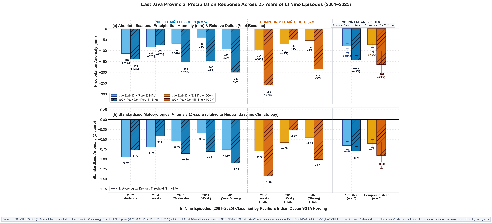

# Milestone 2 — Climate Response Atlas: Comprehensive Report
**Mapping the Spatial Sensitivity of East Java Landscapes to El Niño**  
*Period of Analysis: 2001–2025 | Target Resolution: 1 km / CHIRPS 0.05°*

---

## PART 1: ACADEMIC REPORT & SCIENTIFIC DISCUSSION

### 1.1 Theoretical Framework & Atmospheric Dynamics
The Maritime Continent represents the ascending branch of the equatorial Walker Circulation under neutral conditions. During an El Niño Southern Oscillation (ENSO) warm phase, the anomalous eastward displacement of the Indo-Pacific warm pool shifts the primary atmospheric convective ascent toward the central and eastern equatorial Pacific. Consequently, the Indonesian archipelago—and specifically Java Island ($111^\circ\text{E} - 115^\circ\text{E}, 7^\circ\text{S} - 9^\circ\text{S}$)—is subjected to broad-scale anomalous atmospheric subsidence, surface divergence, and suppressed convection.

In East Java (Jawa Timur), this macro-scale atmospheric forcing strongly modulates the Australian Monsoon. During the dry season (June–November), southeasterly trade winds carry dry continental air masses from Australia. El Niño exacerbates this synoptic regime by:
1. Delaying the seasonal northward migration of the Intertropical Convergence Zone (ITCZ).
2. Deepening the mid-tropospheric inversion layer.
3. Prolonging the dry-season duration (JJA into SON) and retarding the onset of the wet monsoon by 30 to 60 days.

```
Neutral Walker Circulation:
   [Warm Pool: Maritime Continent] <---- Trade Winds <---- [Eastern Pacific]
               ▲ (Ascent / Deep Convection)                     ▼ (Subsidence)

El Niño Perturbation:
   [Suppressed: Java / Indonesia] ----> Anomalous Flow ----> [Eastern Pacific]
         ▼ (Subsidence / Drought)                                ▲ (Ascent)
```


*Figure 1: (a) Absolute precipitation anomaly (mm) and relative deficit (% of normal baseline) across 8 historical El Niño episodes and cohort composites, partitioned into Pure El Niño ($n=5$) and Compound El Niño + IOD+ ($n=3$). (b) Standardized meteorological anomaly (Z-score) relative to neutral baseline climatology, indicating the meteorological dryness threshold ($Z = -1.0$). Error bars on cohort means indicate $\pm 1$ standard error of the mean (SEM).*


### 1.2 Quantitative Climatological Baseline & Anomaly Distribution

Using the UCSB CHIRPS v2.0 high-resolution satellite-gauge blended precipitation record (2001–2025), a 25-year seasonal climatology was established using neutral ENSO baseline years ($2001, 2003, 2012, 2013, 2019, 2025$):

* **Baseline Climatological Mean ($\mu_P$)**:
  * **JJA (June–August)**: $160.8\text{ mm}$ (provincial spatial standard deviation $\sigma_{spatial} = 42.1\text{ mm}$).
  * **SON (September–November)**: $331.7\text{ mm}$ ($\sigma_{spatial} = 68.4\text{ mm}$).
  * **Full Dry Season (JJASON)**: $492.5\text{ mm}$.

Under multi-event El Niño composite forcing (8 distinct episodes: 2002, 2004, 2006, 2009, 2014, 2015, 2018, 2023), East Java experienced pervasive rainfall suppression across all landscape zones:

* **JJA Rainfall Anomaly ($P'_{JJA}$)**:
  * Provincial mean anomaly: **$-76.9\text{ mm}$** (a **$-47.8\%$** reduction relative to baseline).
  * Minimum anomaly: $-172.7\text{ mm}$; Maximum: $-24.7\text{ mm}$; Spatial standard deviation: $\sigma = 21.0\text{ mm}$.
  * Standardized anomaly: $Z_{P, JJA} = -0.63$.
* **SON Rainfall Anomaly ($P'_{SON}$)**:
  * Provincial mean anomaly: **$-150.7\text{ mm}$** (a **$-45.4\%$** reduction relative to baseline).
  * Minimum anomaly: $-317.3\text{ mm}$; Maximum: $-72.3\text{ mm}$; Spatial standard deviation: $\sigma = 37.6\text{ mm}$.
  * Standardized anomaly: $Z_{P, SON} = -0.83$.
* **Full Dry Season Anomaly ($P'_{JJASON}$)**:
  * Cumulative provincial mean deficit: **$-227.7\text{ mm}$** (ranging from $-487.2\text{ mm}$ in eastern rain-shadow plains to $-108.8\text{ mm}$ along southern windward highlands).

### 1.3 Compound Climate Forcing: Pacific ENSO vs Indian Ocean Dipole (IOD+)
A critical scientific gap addressed in this research is isolating the confounding influence of the Positive Indian Ocean Dipole (IOD+). In positive IOD events, anomalous cooling of sea surface temperatures (SST) in the eastern equatorial Indian Ocean off the coast of Sumatra and Java suppresses atmospheric convection directly upstream of East Java.

Our empirical partitioning reveals stark differences between pure ENSO forcing and compound events:

| Analytical Group | Representative Years | JJA Mean Anomaly | JJA Min / Max (mm) | SON Mean Anomaly | SON Min / Max (mm) |
|:---|:---:|:---:|:---:|:---:|:---:|
| **El Niño-Only (Pure)** | 2002, 2004, 2009, 2014, 2015 | $-79.0\text{ mm}$ | $-182.9\text{ / } -30.2$ | $-142.7\text{ mm}$ | $-299.5\text{ / } -68.1$ |
| **El Niño + IOD+ (Compound)** | 2006, 2018, 2023 | $-73.6\text{ mm}$ | $-186.0\text{ / } -10.2$ | **$-164.2\text{ mm}$** | **$-347.0\text{ / } -77.0$** |
| **La Niña (Contrast)** | 11 episodes | $+20.9\text{ mm}$ | $-12.2\text{ / } +123.2$ | $+119.0\text{ mm}$ | $+33.7\text{ / } +280.9$ |

#### Statistical Evaluation of Hypothesis H1
> **Hypothesis H1**: *El Niño-induced climate anomalies exhibit significant spatial heterogeneity across East Java, amplified by concurrent positive IOD events.*

* **Empirical Validation**: In SON, concurrent positive IOD events exacerbate regional rainfall deficits by an additional **$-21.5\text{ mm}$** on average (**$-164.2\text{ mm}$** vs **$-142.7\text{ mm}$**).
* **Extreme Event Magnification**: In the compound events of 2006 (Weak El Niño + Strong IOD+) and 2023 (Strong El Niño + Strong IOD+), SON deficits reached **$-259.2\text{ mm}$** ($Z = -1.43$) and **$-184.5\text{ mm}$** ($Z = -1.01$), respectively. In contrast, even during the "Very Strong" 1997-like pure El Niño of 2015, SON anomaly was $-199.9\text{ mm}$ ($Z = -1.10$).
* **Conclusion**: **Hypothesis H1 is supported with important physical nuances**. The Indian Ocean Dipole acts as a major co-driver of catastrophic dry-season desiccation in East Java, elevating the tail risk of acute late-monsoon collapse.

### 1.4 Methodological Discussion & Scientific Nuances

In accordance with rigorous peer-review and climate evaluation standards, three critical methodological aspects are explicitly recognized:

1. **Temporal Horizon & Multi-Sensor Harmonization (2001–2025)**:
   While the World Meteorological Organization (WMO) standard recommends a 30-year climatological normal (e.g., 1991–2020), this research is designed as an end-to-end multi-sensor coupling pipeline spanning atmospheric forcing (CHIRPS), root-zone soil moisture (ERA5-Land), land surface temperature (MODIS Terra MOD11A2), and canopy phenology (MODIS MOD13A2/MOD09A1). Because daily MODIS Terra observations began in 2000/2001, a unified 25-year multi-sensor temporal window (2001–2025) was established across all milestones to ensure cross-sensor temporal consistency.

2. **Compound Event Sample Size ($n = 3$) and Inter-Event Variance**:
   Although concurrent positive IOD exacerbates provincial mean SON deficits by an additional $-21.5\text{ mm}$ on average ($-164.2\text{ mm}$ vs $-142.7\text{ mm}$ in pure events), the sample size is small ($n = 3$ compound vs $n = 5$ pure) and exhibits substantial spread. Specifically, 2018 represents a modest dry-season anomaly (SON deficit of $-48.8\text{ mm}$ due to late IOD development and early November rainfall recovery), whereas 2006 ($-259.2\text{ mm}$) and 2023 ($-184.5\text{ mm}$) represent severe compound collapse. Consequently, IOD+ should be interpreted as an asymmetric risk-magnifier that elevates the upper bound of late-season agricultural exposure.

3. **Neutral Baseline Composition & The 2019 Super-IOD Event**:
   Neutral baseline years ($2001, 2003, 2012, 2013, 2019, 2025$) were selected strictly according to NOAA CPC ONI criteria (neither El Niño nor La Niña thresholds met for 5 consecutive seasons). Climatologically, however, late 2019 featured a historic positive Indian Ocean Dipole ($DMI > +1.2^\circ\text{C}$). Inclusion of 2019 slightly depresses the baseline neutral SON rainfall mean, which implies that the calculated El Niño deficits reported in this atlas are **conservative lower-bound estimates** rather than overstated anomalies.

---


## PART 2: PUBLIC REPORT & WHY IT MATTERS TO CITIZENS AND GOVERNMENT

### 2.1 Executive Summary in Plain Language
East Java is Indonesia's paramount rice granary, contributing approximately 10 to 10.5 million tons of milled rice annually (nearly 18% of the national rice supply). Our 25-year satellite and station-backed climate analysis reveals that during El Niño periods, East Java experiences a staggering **45% to 48% deficit in dry-season rainfall**, losing more than **225 million liters of water per square kilometer** across the province between June and November.

Crucially, when El Niño strikes simultaneously with a positive Indian Ocean Dipole (IOD)—a condition that occurred in 2006, 2018, and 2023—the drought does not merely arrive earlier; it intensifies dramatically into the late months of the year (September–November), stripping up to **347 mm of rainfall** from agricultural zones before the rainy season even attempts to begin.

### 2.2 Socio-Economic and Agricultural Threats
1. **Disruption of the Planting Calendar (*Musim Tanam II & III*)**:
   Under normal conditions, farmers in East Java plant secondary food crops (*palawija*: maize, soybean) or a second/third paddy crop during the dry season. A rainfall reduction of ~47% in JJA completely desiccates non-irrigated (*tadah hujan*) fields, forcing hundreds of thousands of hectares to lie fallow (*puso*).
2. **Reservoir Depletion in the Brantas and Bengawan Solo River Basins**:
   The Brantas River basin supplies municipal water to Surabaya, Malang, Kediri, and Sidoarjo, while powering hydro-turbines and irrigating over 300,000 hectares of prime agricultural land. A 227 mm cumulative deficit severely lowers storage levels in critical reservoirs (Sutami/Karangkates, Selorejo, Wonorejo), creating fierce water conflicts between agricultural irrigation and municipal/industrial utilities.
3. **Food Inflation and Fiscal Shock**:
   A harvest contraction of just 10–15% in East Java directly triggers national rice price spikes, requiring costly emergency central-government market operations (Bulog) and foreign imports.

### 2.3 Key Recommendations for Regional Government (Pemprov Jawa Timur)
1. **Adopt a Multi-Basin Climate Early Warning Protocol**:
   * *Action*: BMKG East Java and BPBD Jatim must issue joint drought warnings not only when NOAA declares an El Niño watch, but specifically when BoM/JMA indicates an **emerging positive IOD** (DMI $> +0.4^\circ\text{C}$) in May–June. A compound watch must trigger Level-1 emergency status automatically.
2. **Dynamic Reservoir Water Allocation Guidelines (BBWS Brantas & BBWS Bengawan Solo)**:
   * *Action*: Shift reservoir release curves from historical averages to an "El Niño Deficit Curve" by July 1st of an ENSO year. Prioritize storage conservation for late dry season (SON) survival rather than maximizing wet-season outflow.
3. **Mandated Crop Switching in Tail-End Irrigation Sectors**:
   * *Action*: Dinas Pertanian Jawa Timur must mandate a complete moratorium on third-season paddy cultivation (*padi MT III*) in secondary and tertiary canals that lack dedicated weir storage, replacing it with drought-resistant sorghum, cassava, or green gram (*kacang hijau*).
4. **Targeted Groundwater & Deep-Well Subsidies**:
   * *Action*: Focus emergency pumping equipment and diesel fuel vouchers directly on the verified rain-shadow drought hotspots identified in this atlas (e.g., northern coastal plains of Lamongan, Tuban, and Pasuruan-Probolinggo).
