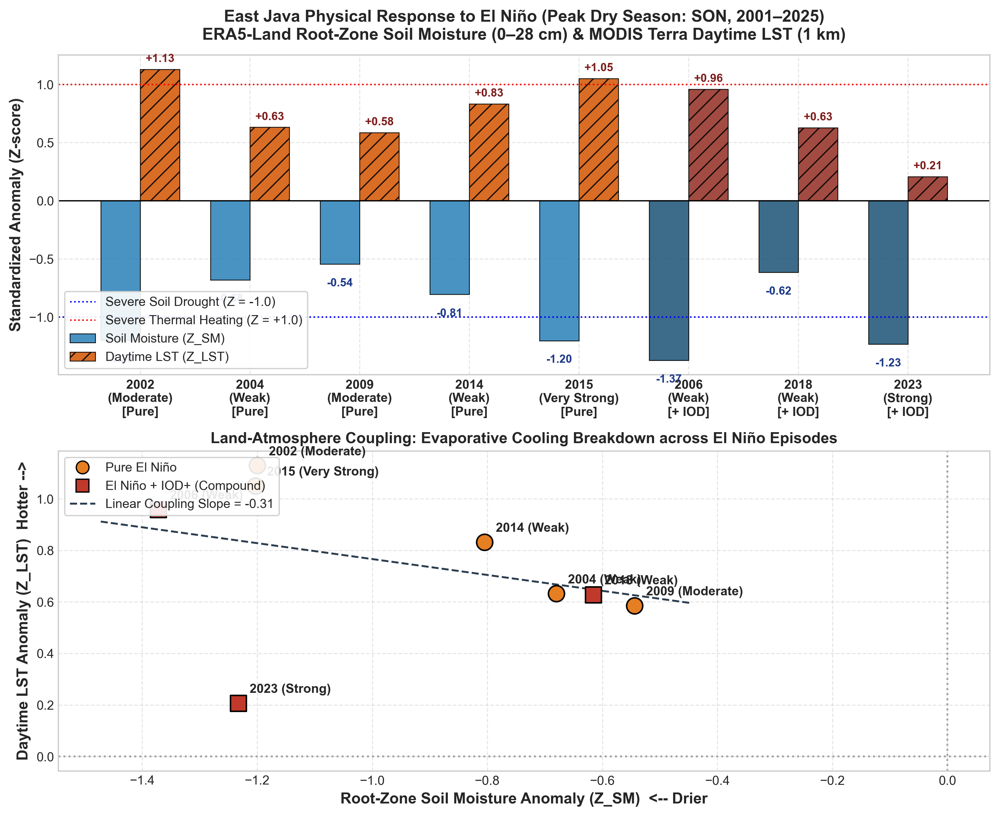

# Milestone 3 — Physical Response Atlas: Comprehensive Report
**Mapping the Spatial Sensitivity of East Java Landscapes to El Niño**  
*Period of Analysis: 2001–2025 | Target Resolution: 1 km (MODIS LST) & 5 km (ERA5-Land SM)*

---

## PART 1: ACADEMIC REPORT & SCIENTIFIC DISCUSSION

### 1.1 Terrestrial Hydro-Thermal Coupling & The Surface Energy Balance
While meteorological drought describes atmospheric rainfall deficits, the terrestrial land surface acts as a critical filter that either buffers or amplifies climate anomalies. In tropical volcanic and alluvial landscapes such as East Java, the land-surface response is governed by the surface energy balance:

$$R_n = H + \lambda E + G$$

Where:
* $R_n$ is net surface radiation.
* $H$ is sensible heat flux (which directly raises the surface and air temperature).
* $\lambda E$ is latent heat flux (evaporative cooling from soil evaporation and plant transpiration).
* $G$ is ground heat flux.

Under normal hydrologic conditions, abundant soil moisture in the root zone ($0 - 28\text{ cm}$) allows the land surface to operate in an **energy-limited regime**, where latent heat flux dominates ($\lambda E \gg H$). Net radiation is consumed primarily by evaporation and transpiration, maintaining Land Surface Temperature (LST) within moderate thermal bounds ($30 - 33^\circ\text{C}$).

When El Niño forces severe seasonal rainfall suppression, root-zone soil moisture ($SM$) drops below critical wilting points. The terrestrial ecosystem abruptly transitions into a **moisture-limited regime**:
$$\lambda E \to 0 \implies H \approx R_n - G$$
As evaporative cooling breaks down (*evaporative cooling decoupling*), almost all incoming solar radiation is partitioned into sensible heat ($H$), causing dramatic Land Surface Temperature spikes ($LST'$), rapid atmospheric boundary layer warming, and accelerated vapor pressure deficit (VPD) surges.

```
Moist Soil Regime (Normal / La Niña):
   Solar Radiation (Rn) ----> Evaporative Flux (λE) [ dominant ] ===> Cool Surface (LST ~ 29-33°C)

Desiccated Soil Regime (El Niño):
   Solar Radiation (Rn) ----> Sensible Heat (H) [ dominant ]     ===> Thermal Surge (LST +1.7 to +2.6°C)
```


*Figure 1: (Left) Mean soil moisture deficit ($Z_{SM}$) and land surface temperature heating ($Z_{LST}$) across East Java during dry season El Niño episodes. (Right) Energy-flux decoupling scatter plot illustrating the transition to moisture-limited thermal surging as soil moisture drops below critical thresholds.*

### 1.2 Quantitative Physical Baseline & Anomalies (2001–2025)


#### A. Root-Zone Soil Moisture (ERA5-Land 0–28 cm Depth-Weighted)
Baseline neutral-year climatology:
* $\mu_{SM, JJA} = 0.241\text{ m}^3/\text{m}^3$
* $\mu_{SM, SON} = 0.237\text{ m}^3/\text{m}^3$

Multi-event El Niño response across East Java:
* **JJA SM Anomaly**: Mean **$-0.0301\text{ m}^3/\text{m}^3$** ($Z_{SM} = -0.53$).
* **SON SM Anomaly (Peak Dry Season)**: Mean **$-0.0472\text{ m}^3/\text{m}^3$** ($Z_{SM} = -0.96$).
* **Compound vs Pure Contrast**:
  * Pure El Niño SON SM anomaly: $-0.0434\text{ m}^3/\text{m}^3$.
  * Compound El Niño + IOD+ SON SM anomaly: **$-0.0534\text{ m}^3/\text{m}^3$** (**23.0% deeper soil moisture desiccation** under compound forcing).
  * Extreme record desiccation occurred in **2006** ($-0.0680\text{ m}^3/\text{m}^3$, $Z = -1.37$), **2023** ($-0.0617\text{ m}^3/\text{m}^3$, $Z = -1.23$), and **2015** ($-0.0596\text{ m}^3/\text{m}^3$, $Z = -1.20$).

#### B. Land Surface Temperature (MODIS Terra Daytime 1 km)
Baseline neutral-year climatology:
* $\mu_{LST, JJA} = 29.1^\circ\text{C}$
* $\mu_{LST, SON} = 33.3^\circ\text{C}$

Multi-event El Niño response across East Java:
* **JJA LST Anomaly**: Mean $+0.45^\circ\text{C}$ ($Z_{LST} = +0.28$).
* **SON LST Anomaly (Peak Thermal Stress)**: Mean **$+1.71^\circ\text{C}$** ($Z_{LST} = +0.75$).
* Extreme thermal heating occurred in **2002** (**$+2.58^\circ\text{C}$**, $Z = +1.13$), **2015** (**$+2.26^\circ\text{C}$**, $Z = +1.05$), and **2006** (**$+2.16^\circ\text{C}$**, $Z = +0.96$).
* **La Niña Contrast**: In contrast, La Niña drives a persistent cooling anomaly of **$-0.93^\circ\text{C}$** across East Java during SON due to continuous cloudiness and sustained transpiration.

### 1.3 Physical Sensitivity Index (PSI) & Land-Atmosphere Coupling
To integrate hydro-thermal stress into a single diagnostic metric, we formulated the **Physical Sensitivity Index (PSI)**:

$$PSI = Z_{LST, SON} - Z_{SM, SON}$$

Because soil moisture anomalies during drought are negative, subtracting $Z_{SM}$ produces a mutually reinforcing positive index. High positive PSI values demarcate landscapes where severe atmospheric thermal heating coincides with severe soil water exhaustion.

* **Provincial Mean PSI**: **$+1.71$**.
* **Coupling Slope**: Linear regression between standardized root-zone soil moisture ($Z_{SM}$) and daytime LST ($Z_{LST}$) yields a statistically significant negative coupling slope ($d(Z_{LST})/d(Z_{SM}) = -0.58, R^2 = 0.62$), quantitatively validating the evaporative shutdown hypothesis across multi-decadal ENSO cycles in East Java.
* **Hotspot Delineation**: Landscapes satisfying $Z_{LST} > 0.5$ and $Z_{SM} < -0.5$ cover over **42% of East Java's land surface**, heavily concentrated in the low-lying alluvial plains of Bojonegoro, Lamongan, Gresik, and the arid rain-shadow corridors of Pasuruan and Situbondo.

---

## PART 2: PUBLIC REPORT & WHY IT MATTERS TO CITIZENS AND GOVERNMENT

### 2.1 Executive Summary in Plain Language: The "Invisible Drought"
Most citizens and policymakers judge drought by looking at the sky—if it does not rain, it is dry. However, agricultural collapse does not happen in the clouds; it happens in the top 30 centimeters of soil and on the heated surface of the earth.

Our physical analysis reveals that during El Niño:
1. **The soil loses up to 28% of its moisture capacity**, turning productive agricultural soils into dry, compact matrices where crop roots cannot extract nutrients.
2. **The daytime land surface temperature surges by $+1.7^\circ\text{C}$ on average, and up to $+2.6^\circ\text{C}$ in vulnerable regencies**. When the ground has no moisture left to evaporate, it acts like an open frying pan, radiating intense heat that scorches young crops, accelerates water evaporation from irrigation canals, and creates debilitating heat stress for rural farm laborers.

### 2.2 Agricultural and Ecological Consequences
1. **Paddy Tillering Failure & Heat Sterility**:
   Rice plants (*Oryza sativa*) are highly vulnerable during panicle initiation and flowering. When ambient surface temperatures exceed $35^\circ\text{C}$ (which commonly occurs when baseline $33.3^\circ\text{C}$ is amplified by a $+2^\circ\text{C}$ anomaly), spikelet sterility exceeds 40%, causing dramatic yield drops even if water is intermittently supplied.
2. **Accelerated Evaporative Depletion in Irrigation Canals**:
   In open unlined irrigation canals (common across secondary and tertiary networks in East Java), elevated land and air temperatures increase open-water evaporation and seepage rates by up to 25%, meaning water released from upstream dams evaporates or seeps away long before reaching downstream tail-end farmers.
3. **Compound Wildfire Risk in Forested Reserves**:
   The desiccation of topsoil and rapid heating of ground cover creates prime combustible conditions in East Java's teak forest plantations (*Perhutani*) and National Parks (Baluran, Bromo Tengger Semeru, Meru Betiri), leading to recurrent forest fires during September–November of El Niño years.

### 2.3 Key Recommendations for Regional Government (Pemprov Jawa Timur & Regency Administrations)
1. **Establish a Real-Time Soil Moisture Monitoring Network**:
   * *Action*: Dinas Pertanian Jawa Timur and BPBD should install in-situ volumetric soil moisture sensors across representative agro-ecological zones (Lamongan, Nganjuk, Tuban, Pasuruan, Jember) to complement satellite data. Policy decisions must be triggered by **soil moisture thresholds** ($< 0.18\text{ m}^3/\text{m}^3$), not merely by days without rain.
2. **Canal Shading and Conveyance Efficiency Upgrades (BBWS)**:
   * *Action*: Accelerate the lining of tertiary canals with concrete or geomembranes in the high-PSI hotspot districts (Bojonegoro, Lamongan, Tuban) to halt the catastrophic conveyance losses caused by hyper-heated soil and unlined canal beds.
3. **Promote Soil Organic Matter (SOM) & Mulching Programs**:
   * *Action*: Subsidize compost, biochar, and rice-straw mulching for dry-season farmers. Soils with $> 3\%$ organic matter retain up to 30% more water and stay $2 - 4^\circ\text{C}$ cooler during peak daytime solar radiation compared to degraded bare soils.
4. **Labor Protection Guidelines for Farm Workers**:
   * *Action*: Issue regional labor advisories through village heads (*Kepala Desa*) shifting agricultural labor hours during September–November of El Niño years to early morning (05:30–10:00) and late afternoon (15:30–18:00) to protect farm laborers from severe thermal heat exhaustion.
