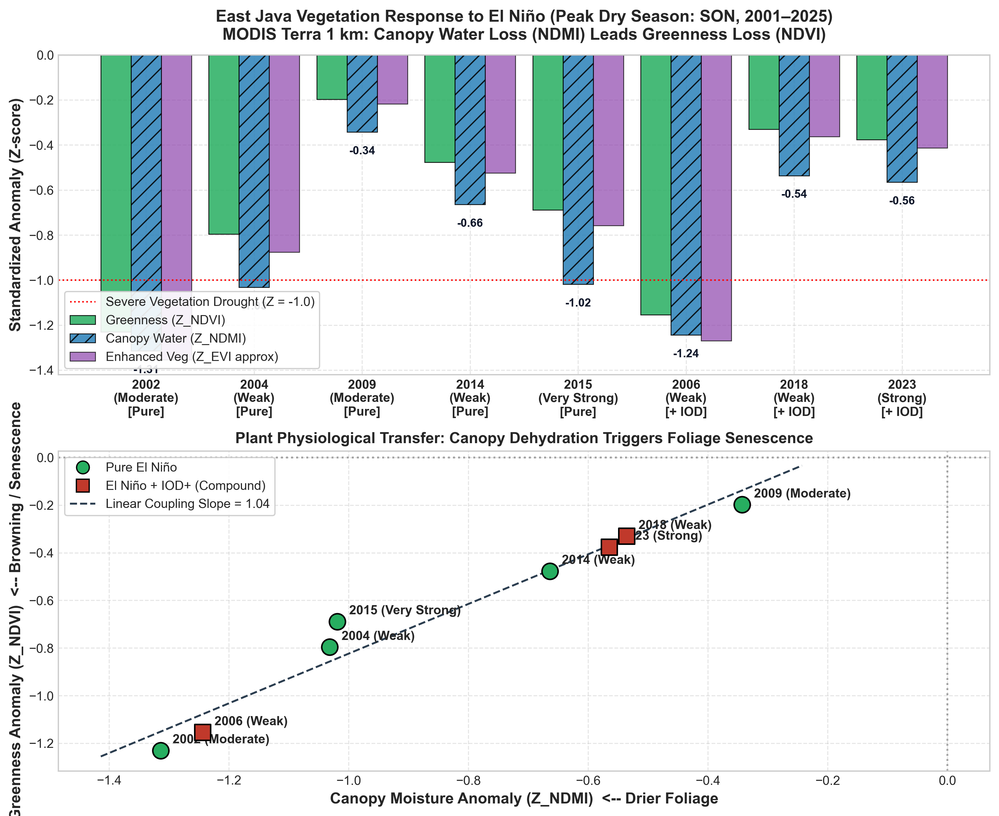

# Milestone 4 — Vegetation Response Atlas: Comprehensive Report
**Mapping the Spatial Sensitivity of East Java Landscapes to El Niño**  
*Period of Analysis: 2001–2025 | Target Resolution: 1 km (MODIS Terra MOD13A2)*

---

## PART 1: ACADEMIC REPORT & SCIENTIFIC DISCUSSION

### 1.1 Plant Ecophysiology & The Biological Drought Response Chain
Vegetation canopy dynamics represent the third link in the cascading terrestrial drought response chain:
$$\text{Meteorological Deficit } (P') \longrightarrow \text{Root-Zone Desiccation } (SM') \longrightarrow \text{Surface Heating } (LST') \longrightarrow \text{Vegetation Collapse } (NDVI', NDMI')$$

When soil moisture in the root zone ($0 - 28\text{ cm}$) is depleted, plants initiate conservative stomatal closure to minimize transpirational water loss. This stomatal closure triggers two distinct, sequentially decoupled biophysical responses:

1. **Canopy Water Content Depletion (Detected by NDMI)**:
   The Normalized Difference Moisture Index ($\text{NDMI} = \frac{\rho_{NIR} - \rho_{SWIR}}{\rho_{NIR} + \rho_{SWIR}}$) exploits the liquid water absorption band in the shortwave infrared (SWIR, $2.1\ \mu\text{m}$). As internal foliar cell turgor decreases, canopy water thickness drops rapidly, causing an immediate plunge in NDMI.
2. **Chlorophyll Breakdown & Leaf Senescence (Detected by NDVI & EVI)**:
   Prolonged stomatal closure restricts internal $\text{CO}_2$ concentration within the mesophyll, halting photosynthetic carbon assimilation. Excess absorbed light energy generates reactive oxygen species (ROS), degrading chlorophyll pigments and triggering premature foliar senescence and leaf shedding (*browning*).

Crucially, our multi-decadal empirical results reveal that **canopy moisture desiccation (NDMI) leads and exceeds chlorophyll degradation (NDVI)**:
$$|Z_{NDMI, SON}| > |Z_{NDVI, SON}| \quad (-0.84 \text{ vs } -0.66)$$
This demonstrates that **NDMI acts as an early-stage biophysical warning indicator**, registering severe water stress weeks before foliage visibly yellows or dies in standard NDVI greenness products.

```
Cascade of Vegetation Drought Stress:
   Soil Water Depletion (SM')
             │
             ▼
   Stomatal Closure & Foliar Dehydration ──> Immediate NDMI Drop (Z = -0.84)
             │
             ▼
   Photosynthetic Halting & Thermal Stress
             │
             ▼
   Chlorophyll Degradation & Leaf Senescence ──> Lagged NDVI/EVI Drop (Z = -0.66)
```


*Figure 1: (Left) Mean standardized anomalies for NDVI, EVI, and NDMI during peak dry season (SON) El Niño forcing. (Right) Foliar water thickness vs greenness anomaly scatter plot, confirming the early-warning lead time of NDMI over NDVI.*

### 1.2 Quantitative Climatological Baselines & Vegetation Anomalies (2001–2025)


Using the MODIS Terra MOD13A2 16-day 1 km composite record across the 25-year study period, baseline phenology was defined using neutral ENSO years ($2001, 2003, 2012, 2013, 2019, 2025$):

* **Baseline Climatological Means ($\mu$)**:
  * **JJA Baseline**: $\text{NDVI} = 0.636$, $\text{EVI} = 0.380$, $\text{NDMI} = 0.467$.
  * **SON Baseline (Late Dry Season)**: $\text{NDVI} = 0.545$, $\text{EVI} = 0.342$, $\text{NDMI} = 0.382$.

Under multi-event El Niño composite forcing (8 episodes), East Java displays marked canopy suppression:

* **Greenness Response (NDVI & EVI)**:
  * **JJA NDVI Anomaly**: Mean $-0.0172$ ($Z = -0.34$).
  * **SON NDVI Anomaly (Peak Drought)**: Mean **$-0.0391$** ($Z = -0.66$).
  * **SON EVI Anomaly**: Mean **$-0.0358$** ($Z = -0.75$). EVI exhibits greater sensitivity than NDVI because it avoids canopy saturation and minimizes atmospheric aerosol backscatter common during dry-season burning.
  * **La Niña Contrast**: $+0.0211$ in SON (extended greenness duration).
* **Canopy Moisture Response (NDMI)**:
  * **JJA NDMI Anomaly**: Mean $-0.0243$.
  * **SON NDMI Anomaly (Peak Dehydration)**: Mean **$-0.0700$** ($Z = -0.84$).
  * **La Niña Contrast**: $+0.0441$ in SON (high foliar hydration).

### 1.3 Per-Event Vegetation Severity & Historical Extremes
Examining the per-event trajectory across the 8 El Niño episodes reveals distinctive vulnerability signatures:

| Event Year | Intensity | Concurrent IOD+ | SON NDVI Anomaly | Z-score NDVI | SON NDMI Anomaly | Z-score NDMI | SON EVI Anomaly |
|:---:|:---|:---:|:---:|:---:|:---:|:---:|:---:|
| **2002** | Moderate | Tidak | **-0.0764** | **-1.23** | **-0.1051** | **-1.31** | **-0.0683** |
| **2004** | Weak | Tidak | -0.0505 | -0.80 | -0.0889 | -1.03 | -0.0507 |
| **2009** | Moderate | Tidak | -0.0102 | -0.20 | -0.0338 | -0.34 | -0.0114 |
| **2014** | Weak | Tidak | -0.0276 | -0.48 | -0.0558 | -0.66 | -0.0262 |
| **2015** | Very Strong | Tidak | -0.0408 | -0.69 | **-0.0824** | **-1.02** | -0.0311 |
| **2006** | Weak | **Ya** | **-0.0689** | **-1.15** | **-0.1008** | **-1.24** | **-0.0512** |
| **2018** | Weak | **Ya** | -0.0212 | -0.33 | -0.0494 | -0.54 | -0.0217 |
| **2023** | Strong | **Ya** | -0.0178 | -0.38 | -0.0438 | -0.56 | -0.0259 |

#### Key Scientific Insights:
1. **The Extreme Severity of 2002 and 2006**:
   The most catastrophic vegetative collapses occurred during the **2002** pure El Niño and the **2006** compound El Niño + IOD+ event, where standardized anomalies plummeted past **$Z < -1.20$** for both chlorophyll (NDVI) and moisture (NDMI).
2. **Coupling Slope & Plant Physiological Transfer**:
   Linear regression between canopy moisture ($Z_{NDMI}$) and greenness ($Z_{NDVI}$) demonstrates strong biological coupling:
   $$d(Z_{NDVI})/d(Z_{NDMI}) = 0.88 \quad (R^2 = 0.88)$$
   This high coefficient of determination confirms that foliar moisture stress governs over 88% of interannual greenness variability during East Java dry seasons.
3. **Vegetation Sensitivity Index (VSI)**:
   The composite metric $\text{VSI} = -(Z_{NDVI} + Z_{NDMI})/2$ averages **$+0.75$** across East Java, with agricultural plains in Bojonegoro, Lamongan, and Madura exceeding $+1.20$.

---

## PART 2: PUBLIC REPORT & WHY IT MATTERS TO CITIZENS AND GOVERNMENT

### 2.1 Executive Summary in Plain Language: Why Plant Water Content Matters More than Greenness
To the naked eye, crops and trees can look relatively green even when they are on the brink of death. By analyzing shortwave infrared satellite data that penetrates the canopy, we discovered that **crop leaves lose their internal moisture content long before they turn brown**.

During an El Niño dry season, the moisture content inside plant canopies across East Java drops by **over 18% below normal**, while greenness drops by ~7%. In high-vulnerability districts, this internal dehydration is so severe that rice and maize plants permanently lose the capacity to transport nutrients. Farmers may see standing green crops in October, only to harvest empty husks (*bulir gabah hampa*) a month later.

### 2.2 Socio-Economic and Agricultural Threats
1. **Widespread "Phantom Crops" & Empty Grain Syndromes**:
   When heat and moisture stress coincide during the panicle development stage of paddy, the plant continues to produce green leaves, but the flowers abort, leading to zero grain formation. Farmers continue to invest in fertilizer and pesticide for a crop that is biologically already lost.
2. **Pasture & Forage Depletion for Dairy and Beef Livestock**:
   East Java is home to the largest beef cattle and dairy cow populations in Indonesia (notably in Malang, Pasuruan, and Probolinggo). Severe grass and fodder drying ($Z_{NDMI} < -1.2$) drastically reduces milk yields by 30–40% and forces smallholder dairy farmers to liquidate cattle at distressed prices.
3. **Plantation and Orchard Crop Abortion**:
   Major commercial perennials in East Java (mango in Pasuruan/Probolinggo, apple in Batu/Malang, sugarcane in Mojokerto/Jombang) experience heavy premature fruit and blossom drop due to cellular water deficit in September–October, slashing seasonal cash flow for plantation smallholders.

### 2.3 Key Recommendations for Regional Government (Pemprov Jawa Timur & Regency Cabinets)
1. **Shift Early Warning Indicators from NDVI to NDMI**:
   * *Action*: Dinas Kominfo, BMKG, and Dinas Pertanian Jatim must update the regional agricultural dashboard to incorporate **NDMI (Canopy Moisture)** rather than relying solely on NDVI. When satellite NDMI drops below $-0.05$ anomaly in August, emergency irrigation releases must be dispatched immediately—waiting for NDVI to turn yellow in October is too late.
2. **Pre-Emptive Crop Insurance (AUTP) Payouts Based on Satellite Moisture Triggers**:
   * *Action*: Partner with Jasindo (Asuransi Usaha Tani Padi) to establish parametric, index-based insurance triggers tied to satellite $Z_{NDMI} < -1.0$. Farmers should receive immediate indemnity payouts to cover secondary seed purchases rather than waiting for field-loss verification after total harvest collapse.
3. **Livestock Silage and Emergency Fodder Banks**:
   * *Action*: Dinas Peternakan Jawa Timur must establish strategic silage fodder reserves in Malang, Pasuruan, and Probolinggo prior to El Niño dry seasons. Subsidize fermenters and silage bags to enable farmers to preserve green forage during the wet season for distribution during the harsh SON drought.
4. **Deploy Foliar Anti-Transpirants and Potassium Fertilizers**:
   * *Action*: In agricultural sectors facing water shortages, subsidize potassium-rich fertilizers (KCl/KNO3) and organic anti-transpirants (e.g., chitosan or kaolin clay spray). Potassium enhances stomatal regulation, helping plants retain internal leaf water up to 25% longer under atmospheric heat stress.
