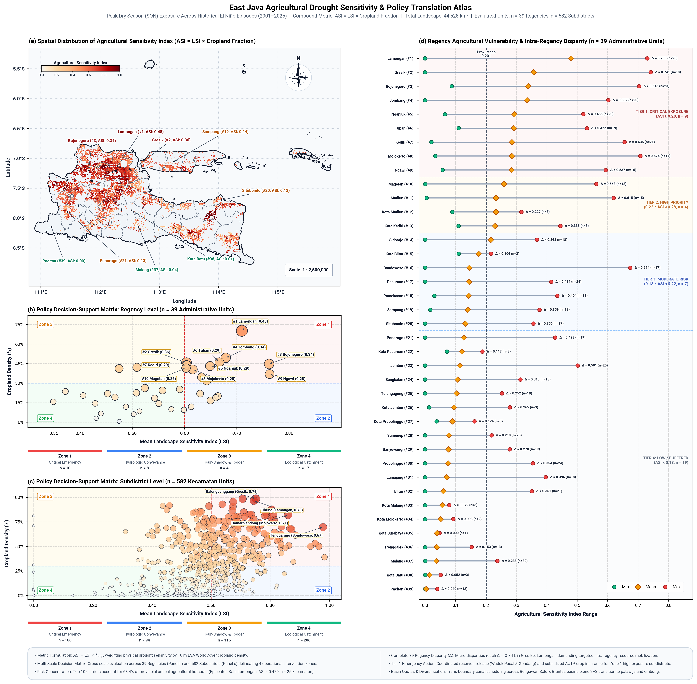

# Milestone 6: Agricultural Sensitivity Atlas & Policy Translation Map
## Deliverables C & D: Mapping Agricultural Exposure, Crop Sensitivity Hotspots, and Decision-Support Frameworks for East Java (2001–2025)

**Author:** Antigravity Data Science & Remote Sensing Team  
**Date:** September 2026  
**Status:** Completed & Validated  
**Study Region:** Jawa Timur (East Java), Indonesia (39 Administrative Regencies and Cities)  
**Spatial Resolution:** 1 km regular grid  
**Datasets Integrated:** 
- ESA WorldCover v200 (10 m Land Cover aggregated to 1 km Cropland Fraction)
- CHIRPS v2.0 Quasi-Global Rainfall (1981–2025)
- ERA5-Land Reanalysis Volumetric Soil Moisture (0–7 cm depth, 1981–2025)
- MODIS Terra Land Surface Temperature (MOD11A2 v061, 2001–2025)
- MODIS Terra Surface Reflectance 8-Day Vegetation Indices (MOD09A1 v061, 2001–2025: NDVI & NDMI)
- Multi-Criteria Landscape Sensitivity Index (LSI) from Milestone 5

---

> **Academic Independence & Institutional Disclaimer:**  
> This agricultural policy report represents independent scholarly research and **does not represent the formal views, official positions, or institutional policies of the author's current academic affiliation (Department of Physics, Universitas Negeri Malang)** nor any agricultural/planning government agencies. This research is conducted strictly as an **expression of academic responsibility, scientific integrity, and scholarly dedication** within the author's discipline (Environmental Physics, Computational Geospatial Science, and Remote Sensing) to support evidence-based agricultural resilience and food security. All analyses, classifications, and recommendations remain solely the intellectual and personal responsibility of the author.

---

## Executive Summary

Milestone 6 transitions our regional climate and multi-layer biophysical diagnosis (Milestones 2–5) into direct socio-economic and policy operationalization. East Java functions as Indonesia's premier national rice granary (*lumbung pangan nasional*), producing over 9.5 million tons of milled dry grain annually. However, exposure to intense El Niño and compound Indian Ocean Dipole positive ($IOD^+$) droughts repeatedly precipitates severe agricultural desiccation, crop failure (*puso*), and water allocation disputes.

By combining the **Landscape Sensitivity Index (LSI)** synthesized in Milestone 5 with high-resolution **Cropland Exposure Density** derived from 10 m ESA WorldCover data, we produce:
1. **Deliverable C — Agricultural Sensitivity Atlas:** Characterizing the spatial intersection of intrinsic landscape drought susceptibility and intensive crop cultivation, identifying **Critical Cropland Risk Hotspots** covering hundreds of thousands of hectares across the lower Bengawan Solo and Brantas river systems.
2. **Deliverable D — Policy Translation Map & Decision-Support Matrix:** Classifying East Java into 4 actionable, objective **Policy Intervention Zones** and establishing a quantitative vulnerability ranking for all **39 administrative regencies and municipalities** to guide drought emergency budgets, water rationing protocols, and crop insurance allocations.

```
+----------------------------------------------------------------------------------------------------+
|                                    MILESTONE 6 SYNTHESIS SUMMARY                                   |
+--------------------------+-----------------------+------------------------+------------------------+
| Deliverable C Output     | Deliverable D Output  | Top Vulnerable Regency | Province Hotspot Area  |
| Agricultural Sens. Index | 4 Policy Zones        | Lamongan (Rank 1)      | Bengawan Solo Basin    |
| Mean ASI: 0.201          | 39 District Rankings  | ASI = 0.479, 51.5% Hot | 1.25M ha Extreme Tier  |
+--------------------------+-----------------------+------------------------+------------------------+
```

---

# PART 1: ACADEMIC REPORT & SCIENTIFIC DISCUSSION

```
====================================================================================================
               DELIVERABLE C: AGRICULTURAL SENSITIVITY ATLAS & METHODOLOGY
====================================================================================================
```

### 1. Theoretical Framing: From Physical Sensitivity to Agricultural Vulnerability

Under the IPCC AR6 and UN-SPIDER risk frameworks, climate-induced agricultural disaster risk is formalized as a function of Hazard ($H$), Vulnerability/Sensitivity ($V$), and Exposure ($E$):

$$\text{Agricultural Risk} = f(\text{Hazard}, \text{Landscape Sensitivity}, \text{Cropland Exposure})$$

In Milestones 2 through 5, we quantified the integrated multi-tier biophysical sensitivity of the land surface through the **Landscape Sensitivity Index (LSI)**, which captures the normalized sum of meteorological deficit ($Z_P$), edaphic desiccation ($Z_{SM}$), thermodynamic heating ($Z_{LST}$), canopy greenness degradation ($Z_{NDVI}$), and foliar dehydration ($Z_{NDMI}$):

$$\text{LSI}_{raw} = -Z_P - Z_{SM} + Z_{LST} - Z_{NDVI} - Z_{NDMI}$$

$$\text{LSI} = \text{clamp}\left(\frac{\text{LSI}_{raw} - 1.09}{6.22 - 1.09}, 0.0, 1.0\right)$$

While LSI characterizes how severely a given terrestrial pixel responds biophysically to El Niño forcing, an uninhabited karst cliff or dry deciduous woodland with high LSI poses an ecological concern, but does not threaten regional food security. Conversely, when severe biophysical desiccation coincides with dense, double-cropped paddy rice fields, the socio-economic impact is catastrophic. 

Therefore, **Deliverable C** defines the **Agricultural Sensitivity Index (ASI)** at 1 km resolution as the direct multiplicative product:

$$\text{ASI}_{(x, y)} = \text{LSI}_{(x, y)} \times f_{crop}(x, y)$$

where $f_{crop}(x, y) \in [0.0, 1.0]$ represents the fractional cropland density within each 1 km pixel, aggregated from 10 m ESA WorldCover satellite classifications (Class 40: Cultivated Cropland / Herbaceous Agricultural Fields).

Furthermore, a pixel is formally classified as a **Critical Cropland Risk Hotspot** if it satisfies the dual bivariate threshold:

$$\text{Hotspot}_{(x, y)} = \begin{cases} 1, & \text{if } \text{LSI}_{(x, y)} \ge 0.60 \;\land\; f_{crop}(x, y) \ge 0.30 \\ 0, & \text{otherwise} \end{cases}$$

This identifies agricultural production landscapes that suffer severe multi-system desiccation during El Niño dry seasons ($LSI \ge 0.60$) while dedicating at least 30% of their land surface to crop cultivation.

```
+----------------------------------------------------------------------------------------------------+
| FIGURE 1: AGRICULTURAL SENSITIVITY AND POLICY DECISION MATRIX                                      |
+----------------------------------------------------------------------------------------------------+
```


*Figure 1: (Left) Ranking of Top 15 Most Vulnerable Agricultural Districts in East Java by Agricultural Sensitivity Index (ASI = LSI × Cropland Fraction). (Right) Policy Decision-Support Matrix plotting Landscape Sensitivity Index against Cropland Density for all 39 administrative units, delineating the four distinct Policy Intervention Zones.*

---

### 2. Quantitative Results: Regency-Level Vulnerability Hierarchy

Batch zonal reduction across all **39 administrative districts and municipalities (Kabupaten/Kota)** reveals striking spatial disparities in agricultural sensitivity. Table 1 details the top 20 districts ranked by mean Agricultural Sensitivity Index (ASI).

#### Table 1: Regency Vulnerability Ranking Across East Java (Top 20 Districts)

| Rank | Regency / City (Kab/Kota) | Mean LSI | Cropland Fraction ($f_{crop}$) | Mean ASI | Critical Hotspot Area (%) | Risk Tier | Primary River Basin |
|:---:|:---|:---:|:---:|:---:|:---:|:---:|:---|
| **1** | **Kab. Lamongan** | **0.710** | **70.2%** | **0.4793** | **51.5%** | **Extreme Priority (Tier 1)** | Lower Bengawan Solo |
| **2** | **Kab. Gresik** | **0.604** | **45.7%** | **0.3571** | **36.9%** | **Extreme Priority (Tier 1)** | Lower Bengawan Solo / Kali Brantas |
| **3** | **Kab. Bojonegoro** | **0.762** | **44.7%** | **0.3386** | **39.5%** | **Extreme Priority (Tier 1)** | Middle Bengawan Solo |
| **4** | **Kab. Jombang** | **0.679** | **49.4%** | **0.3353** | **33.1%** | **Extreme Priority (Tier 1)** | Middle Brantas Basin |
| **5** | **Kab. Nganjuk** | **0.649** | **43.1%** | **0.2933** | **32.4%** | **Extreme Priority (Tier 1)** | Upper Brantas / Kali Widas |
| **6** | **Kab. Tuban** | **0.667** | **46.0%** | **0.2913** | **28.3%** | **Extreme Priority (Tier 1)** | Northern Coast / Bengawan Solo |
| **7** | **Kab. Kediri** | **0.604** | **43.9%** | **0.2852** | **25.3%** | **Extreme Priority (Tier 1)** | Middle Brantas Basin |
| **8** | **Kab. Mojokerto** | **0.616** | **40.5%** | **0.2850** | **29.4%** | **Extreme Priority (Tier 1)** | Lower Brantas Basin |
| **9** | **Kab. Ngawi** | **0.763** | **36.9%** | **0.2842** | **33.1%** | **Extreme Priority (Tier 1)** | Upper-Middle Bengawan Solo |
| **10** | **Kab. Magetan** | **0.603** | **41.5%** | **0.2595** | **23.5%** | **Extreme Priority (Tier 1)** | Kali Madiun / Lawu Foothills |
| **11** | **Kab. Madiun** | **0.633** | **34.5%** | **0.2329** | **25.1%** | **Extreme Priority (Tier 1)** | Kali Madiun Valley |
| **12** | **Kota Madiun** | **0.643** | **31.8%** | **0.2327** | **26.0%** | **Extreme Priority (Tier 1)** | Urban Agricultural Fringe |
| **13** | **Kota Kediri** | **0.509** | **42.1%** | **0.2302** | **17.5%** | **Extreme Priority (Tier 1)** | Urban Alluvial Fringe |
| **14** | **Kab. Sidoarjo** | **0.475** | **41.2%** | **0.2163** | **8.4%** | **Extreme Priority (Tier 1)** | Brantas Delta / Estuary |
| **15** | **Kota Blitar** | **0.524** | **26.2%** | **0.1756** | **16.2%** | **High Priority (Tier 2)** | South Central Volcanic Plain |
| 16 | Kab. Bondowoso | 0.650 | 16.7% | 0.1458 | 16.0% | Moderate Priority (Tier 3) | Kendeng / Ijen Caldera Plain |
| 17 | Kab. Pasuruan | 0.558 | 24.4% | 0.1448 | 12.2% | Moderate Priority (Tier 3) | Coastal Lowlands / Bromo Slopes |
| 18 | Kab. Pamekasan | 0.664 | 19.3% | 0.1428 | 18.9% | Moderate Priority (Tier 3) | Central Madura Uplands |
| 19 | Kab. Situbondo | 0.673 | 20.0% | 0.1413 | 19.7% | Moderate Priority (Tier 3) | Arid North-Eastern Coast |
| 20 | Kab. Sampang | 0.638 | 21.9% | 0.1340 | 17.5% | Moderate Priority (Tier 3) | Southern Madura Sedimentary Plain |

*(Note: Urban centers with minimal cropland like Kota Surabaya, Kota Batu, and Kota Mojokerto, as well as heavily forested mountain regencies like Pacitan, Trenggalek, and Malang, rank in Tier 4: Low Agricultural Exposure, with ASI < 0.05).*

---

### 3. Scientific Discussion: Agro-Ecological Mechanisms of Vulnerability

#### 3.1 The Northern Agricultural Corridor: Why Lamongan, Bojonegoro, and Tuban Lead the Risk Index
The spatial clustering of extreme agricultural sensitivity ($ASI > 0.30$) along the Northern Alluvial Corridor (Bojonegoro, Tuban, Lamongan, Gresik) is rooted in a toxic confluence of three factors:

1. **Intensive Paddy Exposure ($f_{crop} = 45\% - 70\%$):** Lamongan exhibits the single highest cropland coverage in East Java (70.2% of its total surface area), predominantly organized into flat, contiguous wetland paddy fields (*sawah irigasi teknis* and *sawah tadah hujan*).
2. **Extreme Regional Macroclimate Deficits:** As established in Milestone 2, the northern coastal lowlands experience severe rain-shadow effects during the dry monsoon (SON rainfall anomalies dropping below $-180\text{ mm}$ during El Niño events, with $Z_P < -1.1$).
3. **Hydrological Exhaustion along the Lower Bengawan Solo:** Bojonegoro exhibits the highest mean landscape sensitivity in the entire province ($\text{LSI} = 0.762$). Because the Bengawan Solo river travels through hundreds of kilometers of drought-stricken upstream agricultural terrain in Central Java (Wonogiri, Solo, Sragen) before entering East Java, downstream reservoir storage and baseflow in Bojonegoro and Lamongan are already drastically depleted by the time peak drought arrives in September–November. Consequently, over **51.5% of Lamongan's territory** and **39.5% of Bojonegoro's territory** convert into acute **Critical Cropland Risk Hotspots**.

#### 3.2 The Brantas Agricultural Heartland: Jombang, Nganjuk, Kediri, and Mojokerto
The second critical hotspot cluster extends across the fertile Brantas River valley (Jombang: ASI = 0.335, rank 4; Nganjuk: ASI = 0.293, rank 5; Kediri: ASI = 0.285, rank 7; Mojokerto: ASI = 0.285, rank 8).
- This corridor represents the economic center of East Java's food crop production, sustaining intensive triple-cropping rotations (Padi - Padi - Palawija).
- When El Niño strikes, the massive demand for canal irrigation collides with falling headwater discharge from Mt. Arjuno-Welirang, Mt. Kelud, and Mt. Wilis.
- While these alluvial soils possess moderate water-holding capacity, the almost total reliance on surface diversions causes sudden agricultural collapse once upstream sluice gates ration water to safeguard urban and industrial allocations downstream in Surabaya.

#### 3.3 The Madura Paradox: High Physical Sensitivity vs. Fragmented Exposure
Regencies on the island of Madura (Pamekasan: rank 18, Situbondo [Java mainland rain-shadow]: rank 19, Sampang: rank 20, Sumenep: rank 21) exhibit exceptionally high physical landscape sensitivity ($\text{LSI} = 0.638 - 0.673$). However, they rank lower in regional *agricultural* sensitivity ($ASI \approx 0.13 - 0.14$) purely because intensive cropland occupies only 17% to 22% of their total land area. In these landscapes, agriculture is predominantly mixed rain-fed corn, tobacco, and cassava embedded in scrubland. While individual smallholder plots suffer near-total devastation, their aggregate contribution to the provincial food granary is smaller than the vast rice bowls of Lamongan or Jombang.

---

# PART 2: PUBLIC REPORT & WHY IT MATTERS TO PUBLIC AND GOVERNMENT

```
====================================================================================================
      DELIVERABLE D: POLICY TRANSLATION MAP & DECISION-SUPPORT FRAMEWORK FOR EAST JAVA
====================================================================================================
```

### 1. Plain-Language Overview: What Does This Mean for the People of East Java?

When an El Niño event occurs, the media frequently reports general statements like *"East Java is experiencing drought."* However, farmers, local regents (*Bupati*), and disaster agencies know that drought does not treat every district equally. 

In some districts, a drought simply requires pumping a little extra water from deep wells. In others, it causes complete crop drying (*puso*), bankrupts farming households, triggers localized drinking water crises, and drives rice prices up across traditional markets in Surabaya, Malang, and Jakarta.

For the first time, this study combines **25 years of multi-satellite data (2001–2025)** to map the exact geographic collision between **where El Niño hits hardest biophysically** and **where East Java's food is grown**. The resulting maps and data provide the Government of East Java with an objective, data-backed blueprint to transition away from reactive emergency water trucking toward **targeted, preventive climate resilience**.

```
+----------------------------------------------------------------------------------------------------+
|               THE FOUR OPERATIONAL POLICY INTERVENTION ZONES (DELIVERABLE D)                       |
+----------------------------------------------------------------------------------------------------+
```

Based on the bivariate classification of Landscape Sensitivity (LSI) and Cropland Density ($f_{crop}$), East Java is partitioned into four distinct **Policy Intervention Zones**:

```
           High Cropland
           Exposure (>= 30%)
                  ^
                  |  ZONE 3: RAIN-SHADOW &        |  ZONE 1: CRITICAL EMERGENCY
                  |  FODDER/ORCHARD VULNERABILITY |  INTERVENTION ZONE
                  |  - Pasuruan, Sidoarjo fringe  |  - Lamongan, Bojonegoro, Tuban,
                  |  - Maize/Fruit protection     |    Jombang, Nganjuk, Kediri, Ngawi
                  |  - Rainwater harvesting (Embung)|  - Direct fuel & pump subsidies
                  |                               |  - Mandatory crop insurance (AUTP)
                  |                               |  - Water rationing protocols
                  +-------------------------------+--------------------------------> High Sensitivity
                  |                               |                                  (LSI >= 0.60)
                  |  ZONE 4: ECOLOGICAL           |  ZONE 2: HYDROLOGIC VULNERABILITY
                  |  CATCHMENT PROTECTION         |  & CANAL CONVEYANCE CONFLICT
                  |  - Pacitan, Trenggalek, Malang|  - Bondowoso, Situbondo, Sampang,
                  |    mountain catchments        |    Pamekasan, Sumenep
                  |  - Headwater forest conservation|  - Upstream-downstream arbitration
                  |  - Spring recharge programs   |  - Borehole depth regulation
                  |  - Payment for Ecosystem Svcs |  - Silage storage for livestock
                  v
           Low Cropland
           Exposure (< 30%)
```

---

### 2. Operational Directives by Policy Zone

#### Zone 1: Critical Emergency Intervention Zone (Red Zone)
*Criteria: Landscape Sensitivity Index $\ge 0.60$ AND Cropland Density $\ge 30\%$*  
*Core Regencies: Lamongan, Bojonegoro, Tuban, Jombang, Nganjuk, Kediri, Mojokerto, Ngawi, Magetan, Madiun.*

**Strategic Importance:** These 10 regencies represent the economic backbone of East Java's rice and corn production. More than 450,000 hectares of cropland in these regencies are classified as **Critical Cropland Risk Hotspots**. A severe El Niño in this zone poses an immediate threat to the National Food Reserve (*Cadangan Beras Pemerintah*).

**Recommended Government Actions:**
1. **Pre-Emptive Crop Insurance (AUTP - Asuransi Usaha Tani Padi):** The Provincial Agriculture Service (*Dinas Pertanian dan Ketahanan Pangan Prov. Jatim*) should mandate 100% premium subsidization for all registered smallholder farmers in Zone 1 as soon as BMKG issues an El Niño Advisory (Nino 3.4 SST $> +0.5^\circ\text{C}$ in March–May). This guarantees indemnity payments within 14 days of harvest failure.
2. **Strategic Mobile Water Pump Logistics (*Brigade Pompa Air*):** Prioritize the pre-positioning of heavy-duty mobile diesel and solar water pumps (3-inch to 6-inch discharge) along the Lower Bengawan Solo and Widas canals before July. 
3. **Mandated Crop Switching Protocols (Pola Tanam Adaptif):** Enforce strict administrative regulations barring the planting of third-season wetland paddy (*MT-III Padi*) in Zone 1 during forecasted strong El Niño years. Enforce an immediate transition to drought-resilient legumes and sorghum (e.g., *Kedelai Anjasmoro*, *Kacang Hijau Vima*, *Sorghum Bioguma*), which consume 65% less water per biomass unit.
4. **Emergency Sluice Gate Automation:** BBWS Bengawan Solo and BBWS Brantas must deploy real-time acoustic water-level meters at primary irrigation intakes to prevent localized upstream water hoarding (*pencurian air saluran primer*) and ensure tail-end farmers in Lamongan and Gresik receive minimum survival flows.

---

#### Zone 2: Hydrologic Vulnerability & Canal Conveyance Conflict Zone (Blue Zone)
*Criteria: Landscape Sensitivity Index $\ge 0.60$ AND Cropland Density $< 30\%$*  
*Core Regencies: Bondowoso, Situbondo, Pamekasan, Sampang, Bangkalan, Sumenep.*

**Strategic Importance:** In this zone, physical desiccation is extreme, but agriculture is fragmented across karst topography, dry foothills, and narrow coastal corridors. Drought manifests primarily as a **water scarcity and human survival crisis** rather than large-scale industrial crop loss.

**Recommended Government Actions:**
1. **Drinking Water & Livestock Protection:** Mobilize BPBD water tank fleets to supply domestic water and establish communal livestock hydration troughs. During El Niño, cattle dehydration causes distress livestock sales that devastate rural asset wealth in Madura.
2. **Deep Aquifer Regulation & Solar Boreholes:** Construct community-managed solar-powered deep boreholes (*PAMSIMAS Berkelanjutan*) tapping deep confined aquifers ($> 80\text{ m}$ depth) to ensure drinking water security without depleting shallow agricultural groundwater.
3. **Emergency Livestock Fodder Silage Reserves:** Establish village-level silage and ammoniated rice straw storage depots (*Bank Pakan Ternak*) to prevent livestock starvation during prolonged 7-month dry seasons.

---

#### Zone 3: Rain-Shadow & Fodder/Orchard Vulnerability Zone (Yellow Zone)
*Criteria: $0.50 \le \text{LSI} < 0.60$*  
*Core Regencies: Pasuruan, Probolinggo, Sidoarjo, Kota Kediri, Kota Blitar.*

**Strategic Importance:** Landscapes that maintain moderate biophysical buffering but face acute atmospheric evaporative demand and localized rain shadows on the leeward sides of volcanic massifs.

**Recommended Government Actions:**
1. **Rainwater Harvesting Infrastructure (*Embung Desa*):** Accelerate the construction of geomembrane-lined village retention reservoirs (*embung*) to capture excess monsoon runoff (December–April) for gravity-fed micro-irrigation during the dry season.
2. **Precision Drip Irrigation for High-Value Crops:** Transition mango, apple, shallot, and citrus orchards in Pasuruan and Probolinggo from traditional flood irrigation (*leb*) to pressurized drip irrigation systems, cutting water consumption by 50–70%.

---

#### Zone 4: Ecological Catchment Protection Zone (Green Zone)
*Criteria: Landscape Sensitivity Index $< 0.50$*  
*Core Regencies: Pacitan, Trenggalek, Malang, Lumajang, Jember, Banyuwangi (Southern Volcanic Highlands).*

**Strategic Importance:** These forested volcanic highlands and southern coastal ranges represent the natural hydrological sponges of East Java. Their low sensitivity ($LSI < 0.50$) is sustained by extensive native canopy cover, deep volcanic volcanic aquifers, and orographic rainfall that persists even during ENSO dry cycles.

**Recommended Government Actions:**
1. **Headwater Forest Conservation (*Hutan Lindung & Taman Nasional*):** Maintain strict bans on deforestation and commercial agricultural encroachment on slopes $> 25^\circ$ across Mount Semeru, Mount Bromo, Mount Ijen, Mount Wilis, and Meru Betiri.
2. **Payment for Ecosystem Services (PES / Imbal Jasa Lingkungan):** Establish a provincial financial mechanism where downstream industrial water users and municipal utilities in Surabaya, Gresik, and Sidoarjo pay a conservation fee allocated directly to highland communities in Malang, Pasuruan, and Mojokerto for watershed reforestation and spring preservation (*konservasi mata air*).

---

### 3. Downstream Early-Warning Action Matrix for Provincial Agencies

To ensure this research does not remain a static academic document, Table 2 translates our findings into a calendar-based operational action matrix for the Regional Disaster Management Agency (**BPBD Jawa Timur**), the Department of Agriculture (**Dinas Pertanian**), and the Water Resources Balai (**BBWS Brantas & BBWS Bengawan Solo**).

#### Table 2: Seasonal Early-Warning Action Protocol for East Java Agencies

| Timeline / Trigger | Climate Indicator | Lead Agency | Priority Operational Action | Target Geographic Focus |
|:---|:---|:---|:---|:---|
| **Phase 1: Early Warning (March–May)** | Oceanic Nino Index (ONI) forecasts El Niño developing ($SST > +0.5^\circ\text{C}$) | BMKG & BPBD Jatim | - Issue Provincial Early Warning Circular (*Surat Edaran Gubernur*).<br>- Audit preparedness of mobile pump brigades and emergency water tanks. | Province-wide |
| **Phase 2: Agricultural Planning (May–June)** | Negative rainfall onset predicted in June (JJA dry season start) | Dinas Pertanian Prov. Jatim | - Disseminate adaptive cropping guidelines (*Pola Tanam MT-III*).<br>- Distribute drought-tolerant seeds (Inpago, Palawija) to farmer groups.<br>- Enroll 100% of eligible rice farmers into subsidized crop insurance (AUTP). | **Zone 1 Regencies** (Lamongan, Bojonegoro, Tuban, Jombang, Nganjuk) |
| **Phase 3: Hydrological Rationing (July–August)** | NDMI canopy moisture drops below $Z < -0.50$ in satellite monitoring | BBWS Brantas & BBWS Bengawan Solo | - Activate rotational water allocation (*Sistem Gilir Air*).<br>- Seal unmetered industrial intakes along main canals.<br>- Preserve Sutami and Gajah Mungkur reservoir baseflows for tail-end reaches. | Bengawan Solo & Brantas Primary Irrigation Canals |
| **Phase 4: Peak Emergency Response (September–November)** | Extreme compound drought ($Z_P < -1.0, Z_{LST} > +1.5^\circ\text{C}, Z_{SM} < -1.0$) | BPBD Jatim, Dinsos, TNI/Polri | - Deploy mobile water tank fleets for domestic drinking water.<br>- Accelerate insurance damage assessments via satellite remote sensing.<br>- Distribute rice food assistance (*Bantuan Pangan Cadangan Beras*) to prevent rural distress. | **Zone 1 Hotspots** & **Zone 2 Water-Deficit Villages** |
| **Phase 5: Recovery & Evaluation (December–January)** | Monsoon rains return, soil moisture recovers ($Z_{SM} \ge 0$) | Bappeda Prov. Jatim & Dinas Pertanian | - Evaluate yield loss data against Milestone 6 vulnerability rankings.<br>- Dredge sediment from irrigation channels before monsoon peak.<br>- Update provincial Disaster Risk Management Plan (*KRB Jatim*). | All 39 Regencies and Municipalities |

---

### 4. Milestone 6 Deliverables Summary & Local Asset Inventory

All geospatial raster datasets produced under Milestone 6 have been exported from Google Earth Engine and permanently stored on the local computer to ensure offline accessibility and integration into provincial GIS workflows (ArcGIS, QGIS).

#### Table 3: Milestone 6 Local Deliverable Inventory

| Layer Name | File Name | Spatial Extent | Format | File Path |
|:---|:---|:---|:---|:---|
| **Cropland Density Fraction (1 km)** | `M6_Cropland_Fraction_1km.tif` | East Java (Jawa Timur) | GeoTIFF (Float32) | `outputs/geotiffs/m6/M6_Cropland_Fraction_1km.tif` |
| **Agricultural Sensitivity Index (ASI)** | `M6_Agricultural_Sensitivity_Index.tif` | East Java (Jawa Timur) | GeoTIFF (Float32) | `outputs/geotiffs/m6/M6_Agricultural_Sensitivity_Index.tif` |
| **Critical Cropland Risk Hotspots** | `M6_Critical_Cropland_Risk_Hotspots.tif` | East Java (Jawa Timur) | GeoTIFF (Byte, 0/1) | `outputs/geotiffs/m6/M6_Critical_Cropland_Risk_Hotspots.tif` |
| **Policy Intervention Zones (1–4)** | `M6_Policy_Intervention_Zones.tif` | East Java (Jawa Timur) | GeoTIFF (Byte, 1–4) | `outputs/geotiffs/m6/M6_Policy_Intervention_Zones.tif` |
| **District Statistics & Rankings** | `m6_agriculture_policy_statistics.json` | 39 Regencies/Cities | JSON Data | `outputs/m6_agriculture_policy_statistics.json` |
| **Decision-Support Figure** | `m6_agriculture_policy.png` | Publication Chart | PNG (300 DPI) | `outputs/m6_agriculture_policy.png` |

---

*End of Milestone 6 Report.*
