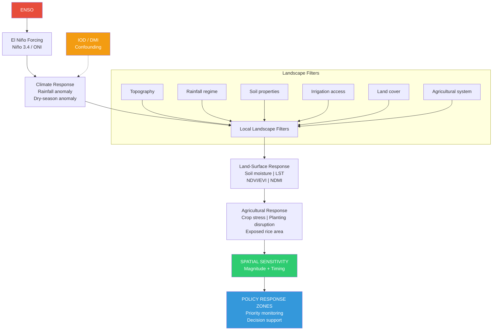
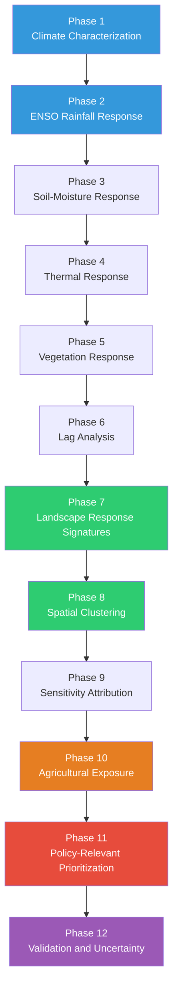
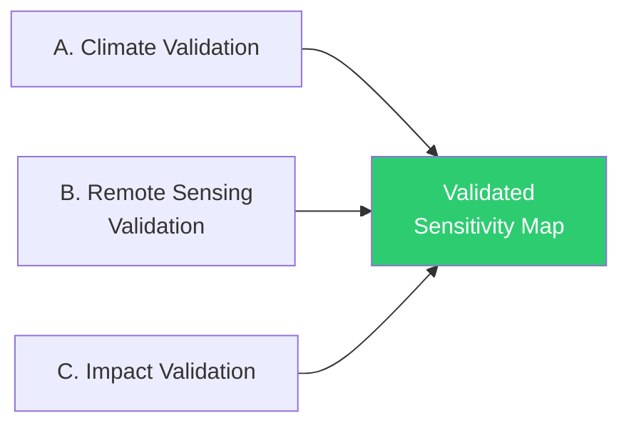

# Research Framework
## Mapping the Spatial Sensitivity of East Java Landscapes to El Niño

> **Dokumen kerja — Milestone 1**
> Versi: 1.0 | September 2026

---

## 1. Research Problem

### 1.1 Konteks

El Niño-Southern Oscillation (ENSO) merupakan pengendali utama variabilitas iklim antar-tahunan di Indonesia. Selama fase El Niño, penurunan konveksi maritim di wilayah Indo-Pasifik menyebabkan defisit curah hujan yang signifikan, memperpanjang musim kering, dan meningkatkan risiko kekeringan pertanian. Jawa Timur — provinsi penghasil beras terbesar Indonesia (~10,5 juta ton GKG/tahun, luas baku sawah >1,2 juta hektar) — menjadi sangat rentan terhadap anomali iklim terkait ENSO.

Namun, respons landscape terhadap El Niño **tidak homogen**. Dua wilayah dengan penurunan curah hujan yang sama dapat menunjukkan respons permukaan lahan (soil moisture, suhu permukaan, kondisi vegetasi) yang sangat berbeda — bergantung pada topografi, tipe tanah, akses irigasi, tutupan lahan, dan sistem pertanian.

**Pertanyaan fundamental:**
> Mengapa forcing iklim yang sama menghasilkan dampak landscape yang berbeda di berbagai wilayah Jawa Timur?

### 1.2 Scientific Gap

Studi-studi sebelumnya telah menetapkan bahwa:
- ENSO menghasilkan pola spasial curah hujan yang heterogen di Jawa, dengan kontras mountains–plains (AMS Journals)
- Sebuah studi 2026 (Universitas Diponegoro) meregionalisasi rainfall response terhadap Niño 3.4 di Jawa Timur menjadi **9 cluster**, menemukan kontras utara–selatan
- Satellite precipitation products mampu menangkap pola meteorological drought secara spasial-temporal di Jawa (PLOS)
- El Niño berkontribusi terhadap variabilitas root-zone water storage, relevan untuk risiko kekurangan air di Jawa Timur (ScienceDirect)
- Severity drought dipengaruhi oleh kombinasi El Niño dan positive IOD (PLOS)

**Gap yang belum terisi:**

Studi-studi di atas berhenti pada level **regionalisasi anomali curah hujan** (ENSO → rainfall heterogeneity). Belum ada penelitian yang secara sistematis memetakan bagaimana perbedaan anomali curah hujan tersebut **diterjemahkan oleh landscape** menjadi rangkaian respons permukaan lahan — dari soil-moisture stress → thermal stress → vegetation stress → agricultural impact — dengan mempertimbangkan magnitude **dan** temporal lag.

### 1.3 Novelty Statement

> We move from regionalizing ENSO-related rainfall anomalies toward **characterizing the spatial sensitivity and temporal response of heterogeneous land-surface and agricultural systems** to ENSO forcing.

```
Previous layer:  ENSO → rainfall heterogeneity
Our layer:       ENSO → rainfall → soil moisture → thermal condition
                 → vegetation → agricultural sensitivity
```

### 1.4 Definisi Operasional Kunci

> **Spatial sensitivity** = magnitude and timing of local land-surface response to a standardized El Niño-related climate anomaly.

Dua komponen:
- **Magnitude** — Seberapa besar permukaan berubah? (ΔP, ΔNDVI, ΔLST, ΔSM)
- **Timing** — Seberapa cepat respons terjadi? (Lag_rainfall→NDVI)

Sehingga: **Sensitivity = magnitude + temporal response**

---

## 2. Conceptual Framework



### Causal Chain (Rantai Kausal)

```
Month 0       Rainfall ↓
                  │
Month 1       Soil moisture ↓
                  │
Month 2       LST ↑
                  │
Month 2–3     NDMI ↓
                  │
Month 3       NDVI ↓
```

---

## 3. Research Questions & Hypotheses

### Research Questions

| Kode | Research Question | Dijawab oleh |
|------|------------------|--------------|
| **RQ1** | How does El Niño influence rainfall and land-surface conditions across heterogeneous landscapes in East Java? | Deliverable A & B |
| **RQ2** | How do the magnitude and timing of land-surface responses to El Niño vary among different landscape regimes? | Deliverable B |
| **RQ3** | Which physical and agricultural landscape characteristics explain the spatial heterogeneity of El Niño sensitivity, and how can these patterns inform geographically targeted drought preparedness? | Deliverable C & D |

### Hypotheses

| Kode | Hypothesis | Diuji pada Phase |
|------|-----------|-----------------|
| **H1** | El Niño-induced climate anomalies exhibit significant spatial heterogeneity across East Java | Phase 1–2 |
| **H2** | Land-surface responses exhibit heterogeneous magnitude and temporal lag relative to El Niño-related rainfall anomalies | Phase 3–6 |
| **H3** | Topography, antecedent moisture conditions, irrigation, and land-use characteristics explain a substantial fraction of the spatial variability in landscape sensitivity | Phase 9 |
| **H4** | Agricultural exposure modifies the policy relevance of landscape sensitivity, such that areas with similar climate sensitivity may have different implications for agricultural drought preparedness | Phase 10–11 |

---

## 4. Study Area Characterization

### 4.1 Geografi & Topografi

**Jawa Timur** (Provinsi Jawa Timur) terletak di ujung timur Pulau Jawa, Indonesia. Provinsi ini memiliki keragaman topografi yang tinggi:

| Zona | Karakteristik | Relevansi Riset |
|------|--------------|-----------------|
| **Central Upland** | Pegunungan vulkanik (Arjuno-Welirang, Semeru, Bromo), fertile | Orographic rainfall enhancement; cooler LST; forest cover |
| **Northern Lowland** | Dataran rendah moderat (Lamongan, Bojonegoro, Tuban) | Major rice granaries; technical irrigation (Brantas basin) |
| **Southern Limestone** | Pegunungan karst, kurang fertil | Limited water retention; rainfed; higher drought vulnerability |
| **Madura & Islands** | Pulau terpisah, akses terbatas | Distinct rainfall regime; limited irrigation |

### 4.2 Iklim

| Parameter | Nilai |
|-----------|-------|
| Tipe iklim | Tropical monsoon & savanna (lower); subtropical highland (upper) |
| Curah hujan rata-rata | ~1.900 mm/tahun (lebih rendah dari Jawa Barat) |
| Musim hujan | Desember – Maret (West Monsoon) |
| Musim kering | Juni – September/Oktober (East Monsoon), 4–6 bulan |
| Suhu dataran rendah | ~28°C rata-rata |
| Suhu dataran tinggi | 23–26°C rata-rata |
| Variabilitas utama | ENSO, IOD, Monsoon |

> [!IMPORTANT]
> Musim yang paling relevan untuk analisis ENSO di Jawa Timur: **JJA (Juni-Juli-Agustus)** dan **SON (September-Oktober-November)** — periode transisi dan puncak musim kering saat efek El Niño paling terasa.

### 4.3 Sistem Pertanian

| Aspek | Detail |
|-------|--------|
| Status nasional | Provinsi penghasil beras terbesar Indonesia |
| Produksi padi (2025) | ~10,5 juta ton GKG |
| Luas baku sawah | >1,2 juta hektar |
| Kabupaten produsen utama | Lamongan, Bojonegoro, Jember, Ngawi, Tuban, Madiun, Banyuwangi |
| Sistem irigasi | Technical irrigation (Brantas River Basin) & rainfed |
| Kerentanan | Wilayah rainfed sangat rentan El Niño; technical irrigation lebih buffered |

### 4.4 Dampak Historis El Niño

- **2015–16 (Very Strong):** Kekeringan luas dan berkepanjangan, gangguan signifikan pada pertanian dan pasokan air di seluruh Jawa
- **2023–24 (Strong + IOD+):** Compound event; musim kering memuncak Oktober 2023; gelombang panas dan kerusakan tanaman lokal
- Secara umum: El Niño menyebabkan keterlambatan tanam, gagal panen, serangan hama (penggerek batang padi, wereng), dan kekurangan air irigasi

---

## 5. ENSO & IOD Event Classification (2001–2025)

### 5.1 El Niño Episodes

| Episode | Intensitas | Peak ONI (°C) | IOD+ Concurrent | Analytic Group |
|---------|-----------|---------------|-----------------|----------------|
| 2002–2003 | Moderate | ~1.3 | No | **El Niño-only** |
| 2004–2005 | Weak | ~0.7 | No | **El Niño-only** |
| 2006–2007 | Weak | ~0.9 | Yes (2006) | **El Niño + IOD+** |
| 2009–2010 | Moderate | ~1.6 | No | **El Niño-only** |
| 2014–2015 | Weak | ~0.6 | No | **El Niño-only** |
| 2015–2016 | **Very Strong** | ~2.6 | No | **El Niño-only** |
| 2018–2019 | Weak | ~0.8 | Yes (2018–19) | **El Niño + IOD+** |
| 2023–2024 | **Strong** | ~2.0 | Yes (2023) | **El Niño + IOD+** |

### 5.2 La Niña Episodes (Kontras)

| Episode | Intensitas |
|---------|-----------|
| 2000–2001 | Weak |
| 2005–2006 | Weak |
| 2007–2008 | Moderate |
| 2008–2009 | Weak |
| 2010–2011 | **Strong** |
| 2011–2012 | Weak |
| 2016–2017 | Weak |
| 2017–2018 | Weak |
| 2020–2021 | Moderate |
| 2021–2022 | Moderate |
| 2022–2023 | Moderate |

### 5.3 Positive IOD Events

2006, 2008, 2012, 2018, 2019, 2023

### 5.4 Analytic Grouping Strategy

| Kelompok | Tahun (Dry Season Focus) | Tujuan |
|----------|-------------------------|--------|
| **El Niño-only** | 2002, 2004, 2009, 2014, 2015 | Isolasi efek ENSO murni |
| **El Niño + IOD+** | 2006, 2018, 2023 | Compound climate forcing |
| **La Niña** | 2000, 2005, 2007, 2008, 2010, 2011, 2016, 2017, 2020, 2021, 2022 | Kontras/pembanding |
| **Neutral** | Tahun sisanya | Baseline climatology |

> [!WARNING]
> **IOD Confounding.** Studi Java menunjukkan bahwa severity drought dipengaruhi oleh kombinasi El Niño dan positive IOD, sementara durasinya juga berkaitan kuat dengan IOD. Sehingga **perlu** memisahkan dan/atau mengontrol efek IOD.

---

## 6. Dataset Catalog

### 6.1 Forcing Variables

| Variable | Dataset | GEE Collection ID | Resolution | Temporal | Role |
|----------|---------|-------------------|------------|----------|------|
| ENSO index | NOAA ONI / Nino 3.4 | — (external CSV) | — | Monthly, 2001–2025 | Primary forcing indicator |
| IOD index | DMI | — (external CSV) | — | Monthly, 2001–2025 | Confounding climate mode |

### 6.2 Response Variables

| Variable | Dataset | GEE Collection ID | Spatial Res. | Temporal Res. | Period |
|----------|---------|-------------------|-------------|---------------|--------|
| Precipitation | CHIRPS Daily | `UCSB-CHG/CHIRPS/DAILY` | ~5.5 km | Daily -> Monthly | 2001–2025 |
| Precipitation (check) | GPM IMERG Monthly | `NASA/GPM_L3/IMERG_MONTHLY_V07` | ~11 km | Monthly | 2001–2025 |
| Soil moisture | ERA5-Land Monthly | `ECMWF/ERA5_LAND/MONTHLY_AGGR` | ~11 km | Monthly | 2001–2025 |
| LST | MODIS Terra 8-day | `MODIS/061/MOD11A2` | 1 km | 8-day -> Monthly | 2001–2025 |
| NDVI/EVI | MODIS Terra 16-day | `MODIS/061/MOD13A2` | 1 km | 16-day -> Monthly | 2001–2025 |
| NDMI (extended) | Landsat 5/7/8/9 SR | `LANDSAT/L**/C02/T1_L2` | 30 m | ~16-day | 2001–2025 |
| NDMI (high-res) | Sentinel-2 SR | `COPERNICUS/S2_SR_HARMONIZED` | 10 m | 5-day | 2015–2025 |

### 6.3 Explanatory / Ancillary Variables

| Variable | Dataset | GEE Collection ID | Resolution |
|----------|---------|-------------------|-----------|
| DEM (elevation, slope) | SRTM | `USGS/SRTMGL1_003` | 30 m |
| Land cover | ESA WorldCover 2021 | `ESA/WorldCover/v200` | 10 m |
| Land cover (historical) | MODIS Land Cover | `MODIS/061/MCD12Q1` | 500 m |
| Admin boundaries | GADM / FAO GAUL | `FAO/GAUL/2015/level2` | Vector |

### 6.4 Agricultural Exposure Data (Open Access)

| Source | Data Content | Access |
|--------|-------------|--------|
| MapBiomas Indonesia | Land cover + Rice Paddy class (annual) | mapbiomas.org + GEE |
| Open-SEA-Rice-10 | Rice harvested area & cropping intensity SEA (10 m) | Zenodo + GEE App |
| BPS Jawa Timur | Luas panen & produksi padi per kabupaten/tahun | jatim.bps.go.id |
| Satu Data Indonesia | Agregasi data pertanian | data.go.id |
| MODIS Land Cover | Cropland class (historical) | GEE built-in |

### 6.5 Irrigation Data

| Source | Data | Access |
|--------|------|--------|
| Geoportal SIGI (Kemen PU) | Daerah Irigasi Permukaan | sigi.pu.go.id |
| Ina-Geoportal (BIG) | Peta tematik irigasi | tanahair.indonesia.go.id |
| OpenStreetMap | Waterways & irrigation features | geofabrik.de |
| FAO AQUASTAT | Global irrigation maps | fao.org/aquastat |

### 6.6 Validation Data

| Source | Data | Access | Validation Type |
|--------|------|--------|-----------------|
| BMKG Data Online | Data iklim harian stasiun (curah hujan, suhu) | dataonline.bmkg.go.id | Climate |
| SACA&D / SA-OBS | Station rainfall SEA + gridded obs | sacad.bmkg.go.id | Climate |
| BPS | Statistik pertanian (gagal panen, luas panen) | jatim.bps.go.id | Impact |
| BNPB / DIBI | Laporan kejadian kekeringan | dibi.bnpb.go.id | Impact |

---

## 7. Variable Dictionary

### 7.1 Forcing Variables

| Symbol | Variable | Unit | Source | Description |
|--------|----------|------|--------|-------------|
| ONI | Oceanic Nino Index | °C | NOAA | 3-month running mean SST anomaly, Nino 3.4 region |
| DMI | Dipole Mode Index | °C | BoM/JMA | SST gradient western–eastern Indian Ocean |

### 7.2 Response Variables

| Symbol | Variable | Unit | Formula | Description |
|--------|----------|------|---------|-------------|
| P | Precipitation | mm/month | — | Monthly rainfall from CHIRPS |
| P' | Rainfall anomaly | mm | `P' = P_ElNino - P_climatology` | Departure from long-term mean |
| Z_P | Standardized rainfall anomaly | — | `Z_P = (P - mu_P) / sigma_P` | Normalized anomaly |
| SM | Soil moisture | m3/m3 | — | Volumetric from ERA5-Land |
| SM' | SM anomaly | m3/m3 | `SM' = SM_ElNino - SM_climatology` | SM departure |
| R_SM/P | SM sensitivity | — | `R_SM/P = delta_SM / delta_P` | SM response per unit rainfall change |
| LST | Land surface temp. | °C / K | — | MODIS daytime LST |
| LST' | LST anomaly | °C | `LST' = LST_ElNino - LST_climatology` | Thermal departure |
| NDVI | Normalized Diff. Veg. Index | — | `(NIR - Red) / (NIR + Red)` | Vegetation vigor |
| NDVI' | NDVI anomaly | — | `NDVI' = NDVI_ElNino - NDVI_climatology` | Vegetation departure |
| EVI | Enhanced Veg. Index | — | MODIS product | Alternative veg. index |
| NDMI | Normalized Diff. Moisture Index | — | `(NIR - SWIR) / (NIR + SWIR)` | Vegetation water stress |
| NDMI' | NDMI anomaly | — | `NDMI' = NDMI_ElNino - NDMI_climatology` | Moisture departure |

### 7.3 Derived / Analytical Variables

| Symbol | Variable | Unit | Formula | Description |
|--------|----------|------|---------|-------------|
| Lag_k | Response lag | months | `argmax_k corr(P_t, NDVI_{t+k})` | Optimal lag of NDVI response to rainfall |
| LRS | Landscape Response Signature | vector | `[P_sens, SM_sens, LST_sens, NDVI_sens, Lag]` | Multi-dimensional sensitivity profile |

### 7.4 Explanatory Variables (Attribution)

| Variable | Source | Type |
|----------|--------|------|
| Elevation | SRTM DEM | Continuous (m) |
| Slope | Derived from DEM | Continuous (degrees) |
| Rainfall climatology | CHIRPS long-term mean | Continuous (mm/yr) |
| Soil properties | SoilGrids / ERA5 | Continuous |
| Distance from coast | Computed | Continuous (km) |
| Irrigation coverage | SIGI / OSM | Binary / proportion |
| Rice fraction | MapBiomas / Open-SEA-Rice | Proportion (0–1) |
| Land-cover composition | ESA WorldCover | Categorical / proportions |
| Cropping intensity | Open-SEA-Rice / BPS | Integer (1–3 harvests/yr) |

---

## 8. Analytical Workflow — 12 Phases

### Unit Analisis

| Level | Resolusi | Fungsi |
|-------|---------|--------|
| Primary analysis | **1 km grid** | Climate-land-surface analysis |
| Agricultural analysis | **1 km** (atau lebih halus jika data tersedia) | Agricultural exposure |
| Policy output | **Kecamatan / Kabupaten** | Administrative aggregation |

```
Pixel/grid (1 km)
   |
Landscape response
   |
Administrative aggregation
   |
Policy unit
```

### Phase Flow



### Phase Details

| Phase | Input | Process | Output |
|-------|-------|---------|--------|
| **1. Climate Characterization** | ONI, DMI | Classify years: El Nino / La Nina / Neutral; separate El Nino-only vs El Nino+IOD+ | Event lookup table |
| **2. ENSO Rainfall Response** | CHIRPS monthly | P' = P_ElNino - P_clim; Z_P standardized; JJA & SON focus; multi-event composite | East Java ENSO Rainfall Response Map |
| **3. Soil-Moisture Response** | ERA5-Land SM | SM' anomalies; R_SM/P = delta_SM/delta_P; sensitivity to rainfall anomaly | SM sensitivity surface |
| **4. Thermal Response** | MODIS LST | LST' anomalies; SM' to LST' relationship; evaporative cooling hypothesis | Thermal sensitivity surface |
| **5. Vegetation Response** | MODIS NDVI/EVI, NDMI | NDVI', NDMI' anomalies; cross-variable response | Vegetation sensitivity surface |
| **6. Lag Analysis** | All time series | corr(P_t, NDVI_{t+k}) for k=0,1,2,3,...; optimal lag per pixel | Response lag map |
| **7. Response Signatures** | All sensitivities + lag | Assemble LRS vector per grid cell | Multi-dimensional signature dataset |
| **8. Spatial Clustering** | LRS vectors | k-means / hierarchical / GMM / SOM; optimal k; regime labeling | Response regime map |
| **9. Attribution** | Clusters + explanatory vars | Regression / Random Forest / SHAP; explain regime membership | Attribution analysis |
| **10. Agricultural Exposure** | Rice/crop data, irrigation | Rice fraction, cropping intensity per grid; overlay with sensitivity | Agricultural sensitivity map |
| **11. Policy Prioritization** | Sensitivity x exposure | Decision-support framework; priority zones; early warning integration | Decision-support map |
| **12. Validation** | All outputs | Climate/RS/impact validation; sensitivity analysis; uncertainty | Validation report |

---

## 9. Expected Outputs & Deliverables

### 9.1 Four Deliverables

| Deliverable | Judul | Pertanyaan yang Dijawab | Phase |
|-------------|-------|-------------------------|-------|
| **A** | **Climate Response Atlas** | Where does East Java respond differently to El Nino? | 1–2 |
| **B** | **Landscape Sensitivity Atlas** | How sensitive are different landscapes? **(Output utama)** | 3–8 |
| **C** | **Agricultural Sensitivity** | Which agricultural landscapes are most responsive to El Nino? | 9–10 |
| **D** | **Policy Translation Map** | Where should limited resources be prioritized? | 11 |

### 9.2 Deliverable Details

**Deliverable A — Climate Response Atlas**
- ENSO rainfall anomaly maps (composite & individual events)
- Spatial regimes of rainfall response
- El Nino-only vs El Nino+IOD+ comparison

**Deliverable B — Landscape Sensitivity Atlas**
- Rainfall sensitivity map
- Soil moisture sensitivity map
- Thermal sensitivity map
- Vegetation sensitivity map
- Response lag map
- Landscape Response Signatures
- Response regime map (clustered)

**Deliverable C — Agricultural Sensitivity**
- Agricultural exposure map (rice fraction, cropping intensity, irrigation)
- Sensitivity x Exposure overlay
- Response regime to agricultural implications table

**Deliverable D — Policy Translation Map**
- East Java El Nino Landscape Sensitivity & Agricultural Decision-Support Map
- Priority monitoring zones
- Response regime descriptions
- Expected response timing per zone
- Uncertainty assessment
- Possible intervention domains

---

## 10. Validation Strategy

### 10.1 Three-Level Validation



#### A. Climate Validation

| What | Against | Source |
|------|---------|--------|
| Satellite/reanalysis rainfall (CHIRPS) | Station gauge data | BMKG Data Online |
| Satellite rainfall | Gridded observational dataset | SACA&D / SA-OBS |
| GPM vs CHIRPS consistency | Inter-product comparison | Internal |

#### B. Remote Sensing Validation

| What | Against | Source |
|------|---------|--------|
| MODIS LST | Station temperature | BMKG |
| Vegetation products | Agricultural observation (if available) | Dinas Pertanian |

#### C. Impact Validation

| What | Against | Source |
|------|---------|--------|
| High-sensitivity zones | Drought event reports | BNPB / DIBI |
| High-sensitivity zones | Agricultural statistics (harvested-area anomalies) | BPS |
| High agri-sensitivity zones | Crop-loss reports | BPS / Dinas Pertanian |
| — | Irrigation/water shortage reports | BBWS / PU |

### 10.2 Sensitivity Analysis

Bagian ini menguji apakah hasil berubah drastis jika:

| Test | Comparison | Priority |
|------|-----------|----------|
| Precipitation product | CHIRPS vs GPM | High |
| Vegetation index | NDVI vs EVI | High |
| Spatial resolution | 1 km vs 5 km | Medium |
| Baseline climatology | All-years vs neutral-only | High |
| ENSO threshold | ONI >= 0.5 vs >= 1.0 | Medium |
| IOD control | Include vs exclude IOD+ years | **Critical** |

---

## 11. Policy Pathway

### 11.1 Prinsip

> [!CAUTION]
> Membangun **decision-support framework** yang menjawab: *Where should limited attention/resources be prioritized?*

### 11.2 Response Regime to Policy Information

| Response Regime | Kondisi | Policy Information |
|----------------|---------|-------------------|
| High sensitivity + high rice exposure | Rentan | **Prioritas monitoring** |
| High sensitivity + irrigation buffer | Climate stress tapi buffered | Water-management monitoring |
| High climate anomaly + low agriculture | Environmental sensitivity | Ecosystem monitoring |
| Low sensitivity + high agriculture | Relatively buffered | Maintain protection |
| High lag | Warning window tersedia | **Early intervention** possible |

### 11.3 Early Warning Integration

Framework ini dirancang untuk menjadi **downstream impact layer** dari BMKG ENSO outlook:

```
BMKG: ENSO outlook / El Nino probability
         |
Our framework: Expected rainfall anomaly
         |
         Landscape-specific sensitivity
         |
         Agricultural exposure
         |
         Priority zones
```

### 11.4 Risk Framework

> [!WARNING]
> Risk Framework: `Risk ~ Hazard x Exposure x Vulnerability`

---

## 12. Academic Guardrails

### 12.1 Novelty Claim

> [!NOVELTY]
> "We move from regionalizing ENSO-related rainfall anomalies toward characterizing the spatial sensitivity and temporal response of heterogeneous land-surface and agricultural systems to ENSO forcing."

### 12.2 ML as Tool

Machine learning (clustering) diposisikan sebagai tools untuk menemukan **response regimes**. Lebih lanjut, penelitian ini juga menggunakan interpretable methods (k-means, hierarchical, GMM, SOM).

---

## Lampiran: Milestone-Phase-Deliverable Mapping

| Milestone | Phase | Deliverable | Python Script (GEE API) | Report |
|:---|:---:|:---|:---|:---|
| **M1** | — | Research Framework | — | [`research_framework.md`](research_framework.md) |
| **M2** | 1, 2 | **A** Climate Response Atlas | [`scripts/m2_climate_response_atlas.py`](scripts/m2_climate_response_atlas.py) | [`reports/M2_Climate_Response_Report.md`](reports/M2_Climate_Response_Report.md) |
| **M3** | 3, 4 | **B** (partial) Physical Response | [`scripts/m3_physical_response.py`](scripts/m3_physical_response.py) | [`reports/M3_Physical_Response_Report.md`](reports/M3_Physical_Response_Report.md) |
| **M4** | 5 | **B** (partial) Vegetation Response | [`scripts/m4_vegetation_response.py`](scripts/m4_vegetation_response.py) | [`reports/M4_Vegetation_Response_Report.md`](reports/M4_Vegetation_Response_Report.md) |
| **M5** | 6, 7, 8 | **B** Landscape Sensitivity Atlas | [`scripts/m5_landscape_sensitivity.py`](scripts/m5_landscape_sensitivity.py) | [`reports/M5_Landscape_Sensitivity_Report.md`](reports/M5_Landscape_Sensitivity_Report.md) |
| **M6** | 9, 10, 11 | **C** + **D** Agri + Policy | [`scripts/m6_agriculture_policy.py`](scripts/m6_agriculture_policy.py) | [`reports/M6_Agriculture_Policy_Report.md`](reports/M6_Agriculture_Policy_Report.md) |
| **M7** | 12 | Validation & Uncertainty | [`scripts/m7_validation_synthesis.py`](scripts/m7_validation_synthesis.py) | [`reports/M7_Validation_Synthesis_Report.md`](reports/M7_Validation_Synthesis_Report.md) |

